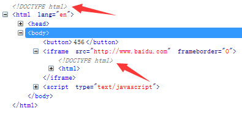
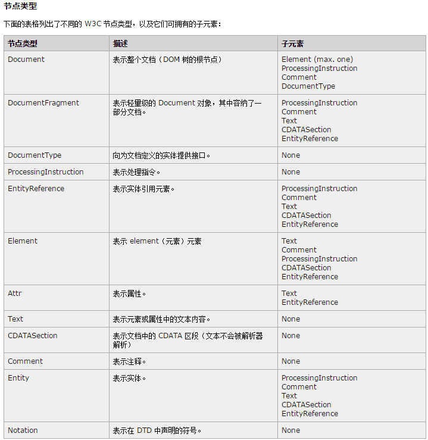
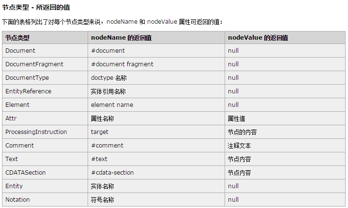
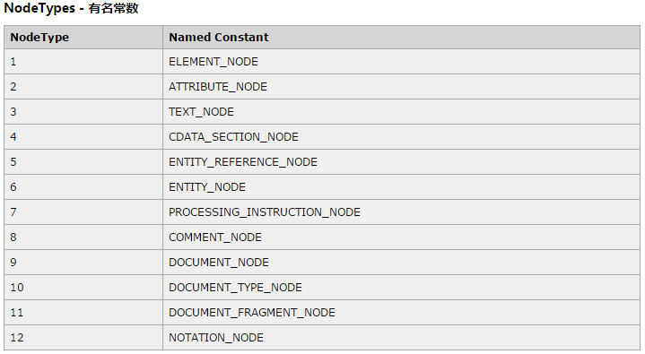
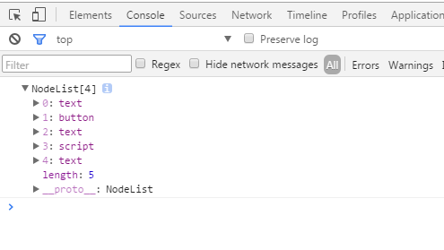
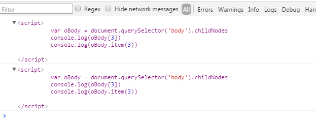
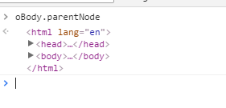
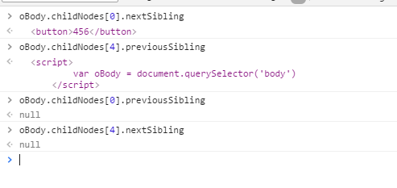
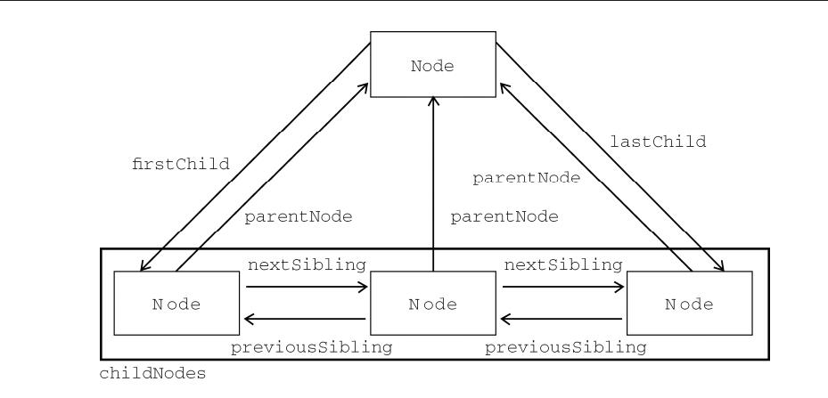
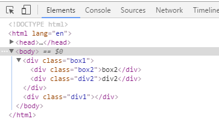

###DOM
DOM(文档对象模型)是针对HTML和XML文档的一个API(应用程序编程接口).简而言之,DOM可以理解为一个访问或操作HTML各种标签的实现标准

**_IE中的所有DOM对象都是以COM对象的形式实现的.这意味着IE中的DOM 对象与原生JavaScript对象的行为或活动特点并不一致_**

####节点层次
可以将一个简单的HTML文档表示为一个层次结构

```html
<html>
    <head>
        <title>Sample Page</title>
    </head>
    <body>
        <p>Hello World!</p>
    </body>
</html>
```

文档节点是每个文档的根节点.在上述代码中,文档节点只有一个`子节点`,即`<html>`元素,我们称之为`文档元素`.文档元素是文档的最外层元素,文档中的其他所有元素都包含在文档元素中.每个文档只能包含一个文档元素.在HTML页面,文档元素始终都是<html>元素.在XML中,没有预定义的元素,因此任何元素都可能成为文档元素

对于一个HTML来说,文档节点是看不到的.如果硬要具象化,我只能想到如下图所示



####Node类型

文档树中的每个节点都是12种节点类型中的一种,如元素即元素节点,元素上挂载的特性就是特性节点,具体类型如下:







以上类型都继承自一个基类型: DOM1级定义了一个Node接口,该接口将有DOM中的所有节点类型实现.这个Node接口在JS中是作为Node类型实现的.**_除了IE外,在其他所有浏览器中都可以访问到这个类型_**.JS中所有节点类型都继承自Node类型(所谓的基类型).因此所有节点都共享相同的基本属性和方法

`obj.nodeType`会返回一个常数,就是图三中的常数,用来表明节点类型

```html
<!DOCTYPE html>
<html lang="en">
<head>
    <meta charset="UTF-8">
    <title>Document</title>
</head>
<body>
    <button>456</button>
    <script>
        var btn = document.querySelector('button')
        console.log( btn.nodeType ) //1
    </script>
</body>
</html>
```

所有浏览器都可以通过比较常量来判断节点类型,但通过名称来判断节点类型只有非IE浏览器和大于IE8版本的IE浏览器

```html
<!DOCTYPE html>
<html lang="en">
<head>
    <meta charset="UTF-8">
    <title>Document</title>
</head>
<body>
    <button>456</button>
    <script>
        // IE8及以下不支持

        var btn = document.querySelector('button')
        btn.nodeType === Node.ELEMENT_NODE ? alert('yes') : alert('no')

    </script>
</body>
</html>
```

#####nodeName/nodeValue
- nodeName

```html
<!DOCTYPE html>
<html lang="en">
<head>
    <meta charset="UTF-8">
    <title>Document</title>
</head>
<body>
    <button>456</button>
    <script>
        var btn = document.querySelector('button')
        if( btn.nodeType === 1 ){
            console.log( btn.nodeName.toLowerCase() ) //button
        }
    </script>
</body>
</html>
```

- nodeValue

```html
<!DOCTYPE html>
<html lang="en">
<head>
    <meta charset="UTF-8">
    <title>Document</title>
</head>
<body>
    <button>456</button>
    <script>
        var btn = document.querySelector('button')
        if( btn.nodeType === 1 ){
            console.log( btn.nodeValue ) //null
        }
    </script>
</body>
</html>
```

对于元素节点来说,nodeName始终保存元素的标签名,nodeValue的值始终是null

#####节点关系
每个节点都有一个`childNodes`属性,保存着一个`NodeList`对象(类似于`{childNodes: NodeList}`).NodeList是一个类数组对象,用于保存一组有序的节点

```html
<!DOCTYPE html>
<html lang="en">
<head>
    <meta charset="UTF-8">
    <title>Document</title>
</head>
<body>
    <button>456</button>
    <script>
        console.log(document.querySelector('body').childNodes)
    </script>
</body>
</html>
```



childNodes保存的有序节点可以通过`方括号`或者`item()`的方式来访问

```html
<!DOCTYPE html>
<html lang="en">
<head>
    <meta charset="UTF-8">
    <title>Document</title>
</head>
<body>
    <button>456</button>
    <script>
        var oBody = document.querySelector('body').childNodes
        console.log(oBody[3])
        console.log(oBody.item(3))
        console.log(oBody.length) //5
    </script>
</body>
</html>
```

打印效果图:



虽然可以通过方括号来访问NodeList的值,而且这个对象也有`length`属性,但是**_NodeList并不是Array的实例_**

NodeList对象的独特之处在于它实际上是基于DOM结构动态执行查询的结果,因此DOM结构的变化能够自动反映在NodeList对象中.也就是说NodeList能时刻反映某个节点下最新的子节点结构层次,而不是我们第一次访问它们的某个瞬间拍摄下来的一张快照

注意,虽然NodeList是动态反映节点的,但是其length属性只是一个瞬间的快照而已

我们也可以把NodeList对象转化为数组

`var arrNodes = Array.prototype.slice.call(someNode.childNodes,0)`

每个节点都有一个`parentNode`属性,该属性指向当前节点的父节点.

```html
<!DOCTYPE html>
<html lang="en">
<head>
    <meta charset="UTF-8">
    <title>Document</title>
</head>
<body>
    <button>456</button>
    <script>
        var oBody = document.querySelector('body').childNodes
    </script>
</body>
</html>
```



包含在childNodes列表中的每个节点相互之间都是同胞节点.通过使用列表中每个节点的`previousSibling`和`nextSibling`属性,可以访问同一个列表中的其他节点.列表中第一个节点的previousSibling属性值为null,列表中最后一个节点的nextSibling属性值为null.





- hasChildNodes()

该方法在节点包含至少一个子节点的情况下返回true,推荐使用该方法来检测特定节点是否具有子节点,而不是用length属性

- ownerDocument()

返回最顶上的文档节点

####操作节点
- appendChild()

appendChild()用于向childNodes列表的末尾添加一个节点.添加节点后,childNodes的新增节点,父节点以及以前的最后一个子节点的关系指针都会相应得到更新.更新完后,appendChild()返回新增节点

```html
<!DOCTYPE html>
<html lang="en">
<head>
    <meta charset="UTF-8">
    <title>Document</title>
    <script>
        window.onload = function(){
            var oDiv1 = document.createElement('div')
            oDiv1.innerHTML = '123'
            var oDiv2 = document.querySelector('body').appendChild(oDiv1)
            console.log(oDiv2 === oDiv1) //true
        }
    </script>
</head>
<body>

</body>
</html>
```

如果传入appendChild()中的节点是文档中已经有的节点,那么结果就是将该节点从原来的位置转移到新位置.任何DOM节点不能同时出现在文档中的多个位置.

```html
<!DOCTYPE html>
<html lang="en">
<head>
    <meta charset="UTF-8">
    <title>Document</title>
    <script>
        window.onload = function(){
            var oDiv2 = document.querySelector('.div2'),
                oBox1 = document.querySelector('.box1')

            oBox1.appendChild(oDiv2)
        }
    </script>
</head>
<body>
    <div class="box1">
        <div class="box2">box2</div>
    </div>
    <div class="div1">
        <div class="div2">div2</div>
    </div>
</body>
</html>
```



如图所示,原本应该在div1中的div2被转移到了box1下面


