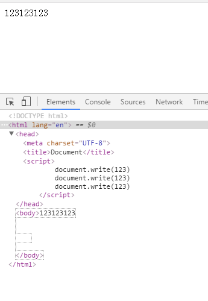
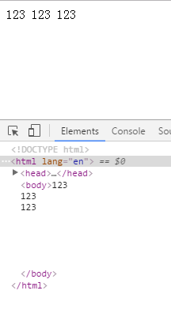

###Document类型
JS通过Document类型(Document类型不单单指html,也包含xml,而HTMLDocument指的才是html)表示文档.在浏览器中,document对象是HTMLDocument(继承自Document类型)的一个实例,表示整个html页面.document对象是window对象的一个属性,因此可以将其作为全局对象访问

Document节点具有下列特性

- nodeType值为9
- nodeName值为null
- nodeValue值为null
- parentNode值为null
- ownerDocument值为null
- 其子节点可能是一个DocumentType(最多一个),Element(最多一个),ProcessingInstruction或Comment

####文档的子节点
访问子节点方法

- document.documentElement: 始终指向`<html>`

- document.childNodes

```html
<!DOCTYPE html>
<html lang="en">
<head>
    <meta charset="UTF-8">
    <title>Document</title>
</head>
<body>
    
    <script>
        var oHtml = document.documentElement

        console.log(oHtml === document.childNodes[1]) //true
        // 这里的document.childNodes[0]表示<!DOCTYPE html>
        console.log(oHtml === document.lastChild) //true
    </script>

</body>
</html>
```

- document.body: 始终指向`<body>`

所有浏览器都支持document.documentElement,document.body

- document.doctype: 表示<!DOCTYPE html> 但好像并没多少用

####文档信息
- document.title: 标签页内容

- document.URL: 页面完整URL(即地址栏中显示的URL)

- document.domain: 只包含页面域名

- document.referrer: 上一个页面的URL,当没有上一个页面时为空字符串

注意document.domain和document.referrer都需要在页面打开,不是本地打开,也可以是本地模拟服务器

####查找元素
- document.getElementById()

该方法接收要取得的元素ID.如果找到相应的元素则返回该元素,否则返回null.如果有多个相同的ID,从上往下取第一个

- document.getElementsByTagName()

该方法接收要取得的元素标签名,返回包含至少0个元素的NodeList.在HTML文档中,这个方法会返回`HTMLCollection对象`,作为一个"动态"集合,该对象与NodeList非常类似

`var images = document.getElementsByTagName('img')`

对于上述代码会将一个HTMLCollection对象保存在images变量中.与NodeList对象类似,可以使用方括号语法或item()方法来访问HTMLCollection对象中的项.而这个对象中的元素数量也可以用length属性获取

HTMLCollection对象还有一个方法叫做namedItem(),使用该方法可以通过元素的name特性取得集合中的项,如果有多个相同的name,从上往下取得第一个

对HTMLCollection来说,可以向方括号中传入数值或字符串形式的索引值.在后台,对数组索引调用item(),对字符串索引调用namedItem()

- document.getElementsByName()

该方法返回给定name特性的所有元素

**_注意getElementById(),getElementsByName()前面必须是document,而getElementsByTagName()前面是要是元素节点就好了,所以我觉得应该是Node.getElementsByTagName()_**

####特殊集合
- document.anchors 包含文档中所有带name特性的`<a>`元素

- document.forms 同document.getElementsByTagName('form')

- document.images 同document.getElementsByTagName('img')

- document.links 包含文档中所有带href特性的`<a>`元素

以上集合始终都可以通过HTMLCollection对象访问到,集合内的项随文档内容更新而更新

####文档写入
- document.write()
- document.writeln()
- document.open()
- document.close()

write(),writeln()方法都接收一个字符串参数,即要写入到输出流中的文本.write()会原样写入,writeln()会在字符串末尾`添加一个换行符(\n)`.在页面被加载的过程中,可以使用这两个方法向页面中动态加入内容

**_writeln()方法的换行的意思不是像块元素一样在视觉上使内容独占一行,而是在html中的换行,也就是在视觉上理解为空格,具体如下图_**

- 以下是write()的html结构和视觉效果



- 以下是writeln()的html结构和视觉效果



#####注意事项
1 如果document.write()在DOMContentLoaded或load事件的回调函数中,当文档加载完成,则会先清空文档(自动调用 `document.open()` ),再把参数写入body内容的开头。

2 在延迟脚本(defer)和异步脚本(async)的js和DOMContentLoaded或load事件的回调函数中运行document.write(),需要手动打开输入流(`document.open()`),否则无效,运行完后,最好手动关闭文档写入(`document.close()`),并且输出内容会重写整个页面

#####示例代码
- 在head中运行document.write()或者引入js,则参数写在body内容的开头

在head中直接写

```html
<!-- 运行前 -->
<head>
    <script>
        document.write('<h1>write()</h1>');
    </script>
</head>
<body>
    <p>pp</p>
</body>

<!-- 运行后 -->
<head>
    <script>
        document.write('<h1>write()</h1>');
    </script>
</head>
<body>
    <h1>write()</h1>
    <p>pp</p>
</body>
```

在head中引入js

```html
<!DOCTYPE html>
<html lang="en">
<head>
    <meta charset="UTF-8">
    <title>Document</title>
    <script type="text/javascript" src="test.js"></script>
</head>
<body>
    <p>pp</p>
</body>
</html>
```

test.js中的内容

```javascript
document.write('<h1>write()</h1>')
```

结果

```html
<!DOCTYPE html>
<html lang="en">
<head>
    <meta charset="UTF-8">
    <title>Document</title>
    <script type="text/javascript" src="test.js"></script>
</head>
<body>
    <h1>write()</h1>
    <p>pp</p>
</body>
</html>
```

- 在body中运行document.write()或者引入js,则参数写在运行的script标签后面

在body中直接写

```html
<!-- 运行前 -->
<!DOCTYPE html>
<html lang="en">
<head>
    <meta charset="UTF-8">
    <title>Document</title>
</head>
<body>
    <p>pp</p>
    <script>
        document.writeln('<h1>write()</h1>')
    </script>
</body>
</html>

<!-- 运行后 -->
<!DOCTYPE html>
<html lang="en">
<head>
    <meta charset="UTF-8">
    <title>Document</title>
</head>
<body>
    <p>pp</p>
    <script>
        document.writeln('<h1>write()</h1>')
    </script>
    <h1>write()</h1>
</body>
</html>
```

在body中引入js

```html
<!DOCTYPE html>
<html lang="en">
<head>
    <meta charset="UTF-8">
    <title>Document</title>
</head>
<body>
    <p>pp</p>
    <script type="text/javascript" src="test.js"></script>
</body>
</html>
```

test.js中的内容

```javascript
document.write('<h1>write()</h1>')
```

结果

```html
<!DOCTYPE html>
<html lang="en">
<head>
    <meta charset="UTF-8">
    <title>Document</title>
</head>
<body>
    <p>pp</p>
    <script type="text/javascript" src="test.js"></script>
    <h1>write()</h1>
</body>
</html>
```

- 延迟脚本或异步脚本中需要手动开关输入流,并且输出内容会重写整个页面

```html
<!DOCTYPE html>
<html lang="en">
<head>
    <meta charset="UTF-8">
    <title>Document</title>
    <script type="text/javascript" defer src="test.js"></script>
</head>
<body>
    <p>pp</p>
</body>
</html>
```

test.js中的内容

```javascript
document.open()
document.write('<h1>write()</h1>')
document.close()
```

结果

```html
<!DOCTYPE html>
<html lang="en">
<head>
    <meta charset="UTF-8">
    <title>Document</title>
    <script type="text/javascript" defer src="test.js"></script>
</head>
<body>
    <h1>write()</h1>
</body>
</html>
```

**_严格型XHTML文档不支持文档写入.对于按照application/xml+xhtml内容类型提供的页面,这两个方法同样无效_**