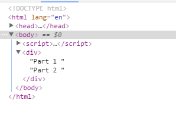
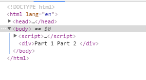

###Text类型
####特征
- nodeType值为3
- nodeName值为#text
- nodeValue值为节点包含的文本
- parentNode是一个Element
- 不支持(没有)子节点

####创建文本节点
```javascript
var element = document.createElement('div'),
    textNode = document.createTextNode('Hello World!')

element.className = 'message'

element.appendChild(textNode)

document.body.appendChild( element )
```

####规范化文本节点
`Node.normalize()`方法将当前节点和它的后代节点"规范化"(normalized).在一个"规范化"后的DOM树中,不存在一个空的文本节点,或者两个相邻的文本节点.

**_"空的文本节点"并不包括空白字符(空格,换行等)构成的文本节点_**

两个以上相邻文本节点的产生原因包括:

- 通过脚本调用有关的DOM接口进行了文本节点的插入和分割等
- HTML中超长的文本节点会被浏览器自动分割为多个相邻文本节点

```javascript
var wrapper = document.createElement("div")

wrapper.appendChild(document.createTextNode("Part 1 "))
wrapper.appendChild(document.createTextNode("Part 2 "))

// 这时(规范化之前),wrapper.childNodes.length === 2
// wrapper.childNodes[0].textContent === "Part 1 "
// wrapper.childNodes[1].textContent === "Part 2 "

wrapper.normalize();
// 现在(规范化之后), wrapper.childNodes.length === 1
// wrapper.childNodes[0].textContent === "Part 1 Part 2"
```

规范前



规范后



####分割文本节点
splitText()作用与normalize()方法相反

```html
<!DOCTYPE html>
<html>
<head>
    <title>Text Node Example 5</title>
    <style type="text/css">
        .message {
            font-weight: bold;
            color: #0f0;
        }
    </style>
</head>
<body>
    <input type="button" value="Add Node" onclick="addNode()">

    <script type="text/javascript">
        function addNode(){
        
            var element = document.createElement("div");
            element.className = "message";
            
            var textNode = document.createTextNode("Hello world!");
            element.appendChild(textNode);
            
            document.body.appendChild(element);
            
            var newNode = element.firstChild.splitText(5);
            alert(element.firstChild.nodeValue);  //"Hello"
            alert(newNode.nodeValue);             //" world!"
            alert(element.childNodes.length);     //2
        }
    </script>
</body>
</html>
```