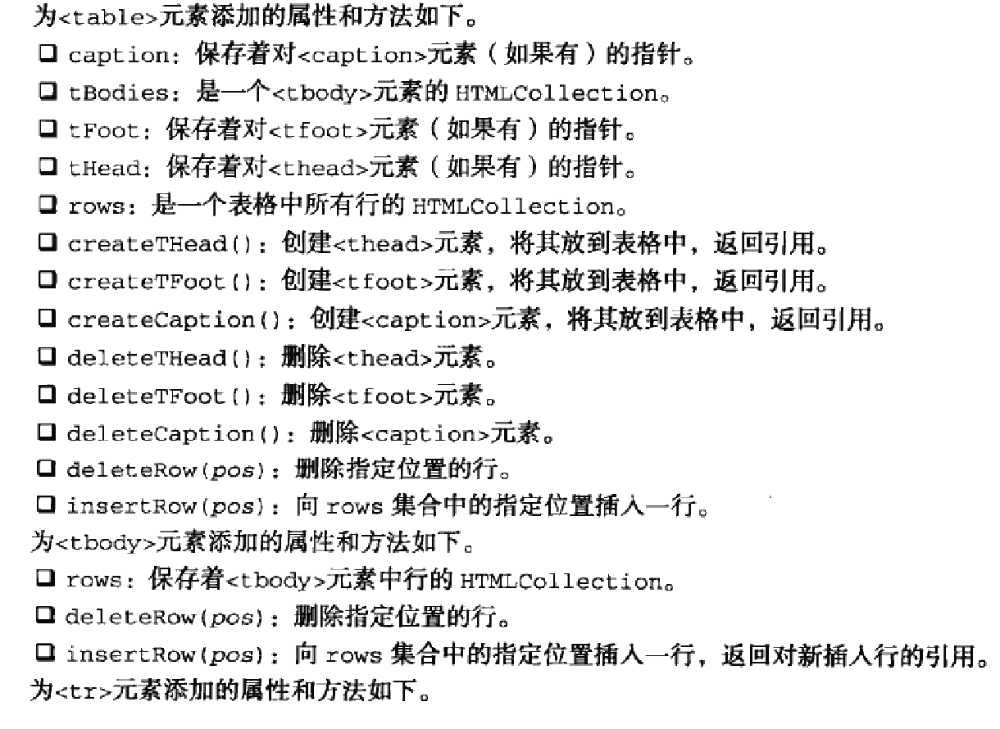
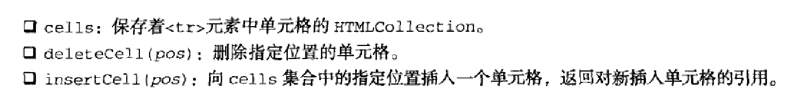

操作表格的方法




```javascript
var table = document.createElement('table')
table.border = 1
table.width = "100%"

var tbody = document.createElement("tbody")
table.appendChild(tbody)

tbody.insertRow(0)
tbody.rows[0].insertCell(0)
tbody.rows[0].cells[0].appendChild(document.createTextNode("1,1"))
tbody.rows[0].insertCell(1)
tbody.rows[0].cells[1].appendChild(document.createTextNode("2,1"))

document.body.appendChild(table)
```
