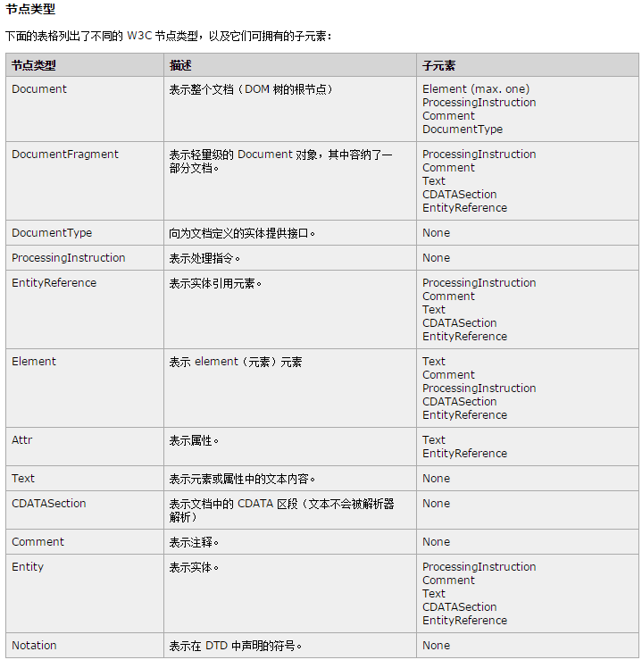
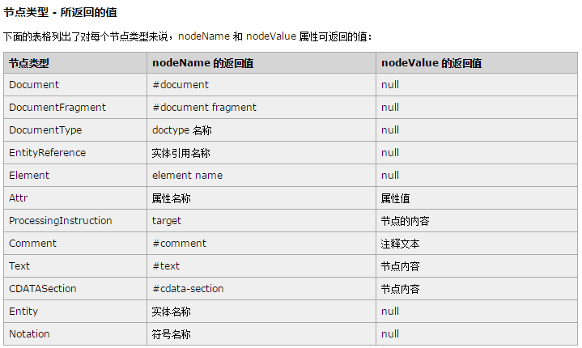
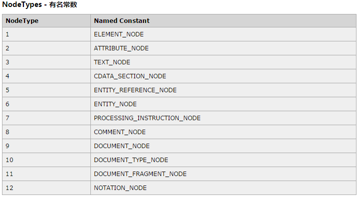

###DOM
DOM(文档对象模型)是针对HTML和XML文档的一个API(应用程序编程接口).简而言之,DOM可以理解为一个访问或操作HTML各种标签的实现标准

**_IE中的所有DOM对象都是以COM对象的形式实现的.这意味着IE中的DOM 对象与原生JavaScript对象的行为或活动特点并不一致_**

####节点层次
可以将一个简单的HTML文档表示为一个层次结构

```html
<html>
    <head>
        <title>Sample Page</title>
    </head>
    <body>
        <p>Hello World!</p>
    </body>
</html>
```

文档节点是每个文档的根节点.在上述代码中,文档节点只有一个`子节点`,即`<html>`元素,我们称之为`文档元素`.文档元素是文档的最外层元素,文档中的其他所有元素都包含在文档元素中.每个文档只能包含一个文档元素.在HTML页面,文档元素始终都是<html>元素.在XML中,没有预定义的元素,因此任何元素都可能成为文档元素

对于一个HTML来说,文档节点是看不到的.如果硬要具象化,我只能想到如下图所示


文档树中的每个节点都是12种节点类型中的一种,如元素即元素节点,元素上挂载的特性就是特性节点,具体类型如下:







以上类型都继承自一个基类型: DOM1级定义了一个Node接口,该接口将有DOM中的所有节点类型实现.这个Node接口在JS中是作为Node类型实现的.**_除了IE外,在其他所有浏览器中都可以访问到这个类型_**.JS中所有节点类型都继承自Node类型(所谓的基类型)

`obj.nodeType`会返回一个常数,就是图三中的常数,用来表明节点类型
