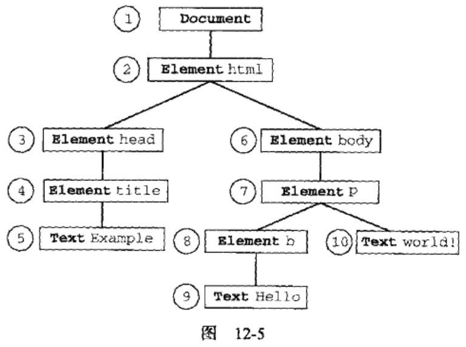
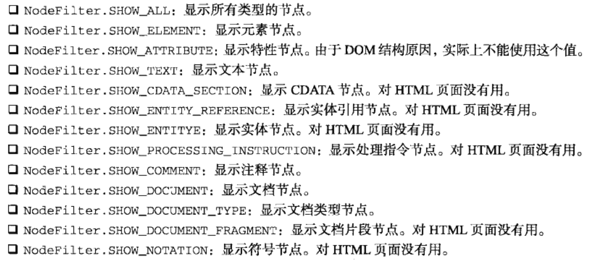

###遍历
"DOM2级遍历和范围"模块定义了两个用于辅助完成顺序遍历DOM结构的类型: `NodeIterator`和`TreeWalker`.这两个类型能够基于给定的起点对DOM结构执行深度优先(depth-first)的遍历操作.

IE8不支持

```javascript
var supportsTraversals = document.implementation.hasFeature("Traversal","2.0"),
    supportsNodeIterator = typeof document.createNodeIterator == "function",
    supportsTreeWalker = typeof document.createTreeWalker == "function"

console.log(supportsTraversals) //true
console.log(supportsNodeIterator) //true
console.log(supportsTreeWalker) //true
```

遍历顺序,如下

```html
<!DOCTYPE html>
<html>
    <head>
        <title>Example</title>
    </head>
    <body>
        <p>
            <b>Hello</b>
            World!
        </p>
    </body>
</html>
```



####NodeIterator
可以使用`document.createNodeIterator()`方法创建它的新实例.该方法接收下列4个参数

- root: 想要作为搜索起点的树中的节点

- whatToShow: 表示要访问哪些节点的数字代码

- filter: 是一个NodeFilter对象,或者一个表示应该接受还是拒绝某种特定节点的函数.

- entityReferenceExpansion: 布尔值,表示是否要扩展实体引用.该参数在HTML页面中没用,因为其中的实体引用不能扩展

whatToShow参数是一个位掩码,通过应用一或多个过滤器(filter)来确定要访问哪些节点.该参数的值以常量形式在NodeFilter类型中定义,如下所示



除了NodeFilter.SHOW_ALL之外,可以使用按位或操作符来组合多个选项,如`var whatToShow = NodeFilter.SHOW_ELEMENT | NodeFilter.SHOW_TEXT`

可以通过createNodeIterator()方法的filter参数来指定自定义的NodeFilter对象,或者指定一个功能类似节点过滤器的函数.每个NodeFilter对象只有一个方法,即`acceptNode()`;如果应该访问给定节点,该方法返回`NodeFilter.FILTER_ACCEPT`,如果不应该访问给定的节点,该方法返回`FILTER_ACCEPT`

例如,创建一个只显示<p>元素的节点迭代器

```javascript
var filter = {
    acceptNode: function(node){
        return node.tagName.toLowerCase() === 'p' ? NodeFilter.FILTER_ACCEPT : NodeFilter.FILTER_ACCEPT 
    }
}

//或者

function filter(node){
    return node.tagName.toLowerCase() === 'p' ? NodeFilter.FILTER_ACCEPT : NodeFilter.FILTER_ACCEPT
}
```

如果不指定过滤器,那么第三个参数传入null

NodeIterator类型的两个主要方法是`nextNode()`和`previousNode()`.在深度优化的DOM子树遍历中,nextNode()方法用于向前前进一步,而previousNode()用于向后后退一步.在刚创建的NodeIterator对象中,有一个内部指针指向根节点,因此第一次调用nextNode()会返回根节点.当遍历到DOM子树的最后一个节点时,nextNode()返回null.previousNode()方法的工作机制类似

```html
<!DOCTYPE html>
<html>
    <head>
        <title>NodeIterator Example</title>
        <script type="text/javascript">

           function makeList() {
               var div = document.getElementById("div1");
               var iterator = document.createNodeIterator(div, NodeFilter.SHOW_ELEMENT, null, false);

               var output = document.getElementById("text1");
               var node = iterator.nextNode();
               while (node !== null) {
                   output.value += node.tagName + "\n";
                   node = iterator.nextNode();
               }

           }

        </script>
    </head>
    <body>
        <div id="div1">
            <p><b>Hello</b> world!</p>
            <ul>
                <li>List item 1</li>
                <li>List item 2</li>
                <li>List item 3</li>
            </ul>
        </div>
        <textarea rows="10" cols="40" id="text1"></textarea><br />
        <input type="button" value="Make List" onclick="makeList()" />
    </body>
</html>
```

####TreeWalker
TreeWalker是NodeIterator的更高级版本.除了包括nextNode()和previousNode()在内的相同功能之外,该类型还提供了下列用于在不同方向上遍历DOM结构的方法

- parentNode(): 遍历到当前节点的父节点

- firstChild(): 遍历到当前节点的第一个子节点

- lastChild(): 遍历到当前节点的最后一个子节点

- nextSibling(): 遍历到当前节点的下一个同辈节点

- previousSibling(): 遍历到当前节点的上一个同辈节点

创建TreeWalker对象使用`document.createTreeWalker()`方法,参数与创建NodeIterator对象参数一致

在TreeWalker的第三个参数filter可以返回一个不同的值: NodeFilter.FILTER_REJECT.该值得作用是跳过相应节点以及该节点的整个子树

```html
<!DOCTYPE html>
<html>
    <head>
        <title>TreeWalker Example</title>
        <script type="text/javascript">

           function makeList() {
               var div = document.getElementById("div1");
               var walker = document.createTreeWalker(div, NodeFilter.SHOW_ELEMENT, null, false);

               var output = document.getElementById("text1");
               
               walker.firstChild();   //go to <p>
               walker.nextSibling();  //go to <ul>
               var node = walker.firstChild();  //go to <li>
               while (node !== null) {
                   output.value += node.tagName + "\n";                   
                   node = walker.nextSibling();
               }

           }

        </script>
    </head>
    <body>
        <p><strong>Note:</strong> The <code>TreeWalker</code> object has only been implemented in Internet Explorer 9, Chrome, Opera (version 7.6 and higher), Safari (version 1.3 and higher), and Firefox (version 1.0 and higher). It has not been implemented in Internet Explorer 8 or earlier (so this example won't work).</p>

        <div id="div1">
            <p>Hello <b>World!</b></p>
            <ul>
                <li>List item 1</li>
                <li>List item 2</li>
                <li>List item 3</li>
            </ul>
        </div>
        <textarea rows="10" cols="40" id="text1"></textarea><br />
        <input type="button" value="Make List" onclick="makeList()" />
    </body>
</html>
```
