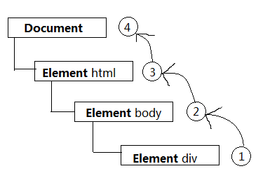
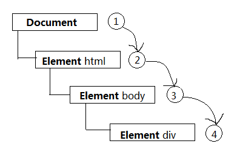
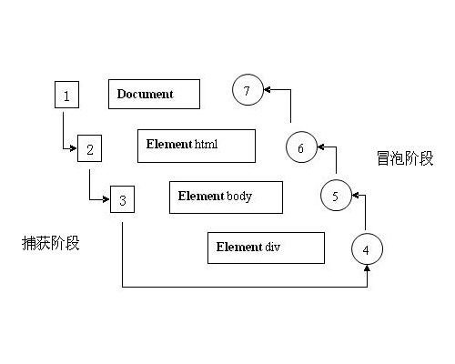

###事件
JS与HTML之间的交互是通过`事件`实现的.事件,就是文档或浏览器窗口中发生的一些特定的交互瞬间.可以使用`侦听器`(或处理程序)来预订事件,以便事件发生时执行相应的代码

####事件流
>当浏览器发展到第四代时(IE4及Netscape Communicator4),浏览器开发团队遇到一个很有意思的问题: 页面的哪一部分会拥有特定的事件? 要明白该问题问的是什么,可以想象画在一张纸上的一组同心圆.当把手指放在圆心上时,那么手指指向的不仅仅是一个圆,而是这一组同心圆.两家公司的浏览器开发团队在看待浏览器事件方面是一致的.如果单击了某个按钮,他们都认为单击事件不仅仅发生在按钮上.换句话说,在单击按钮的同时,也单击了按钮的容器元素,甚至单击了整个页面

`事件流`描述的是从页面中接收事件的顺序.

IE的事件流是`事件冒泡流`

Netscape Communicator的事件流是`事件捕获流`

#####事件冒泡流
事件开始时由最具体的元素(文档中嵌套层次最深的那个节点,姑且称作事发节点)接收,然后逐级向上传播到较为不具体的节点(文档)

```html
<!DOCTYPE html>
<html lang="en">
    <head>
        <title>Event Bubbling Example</title>
    </head>
    <body>
        <div id="myDiv">Click Me</div>
    </body>
</html>
```

当单击了div元素,那么click事件会沿DOM树向上传播,如图:



所有浏览器都支持事件冒泡.

#####事件捕获
事件捕获的思想是不太具体的节点应该更早接收到事件,而最具体的节点(即事发节点)应该最后接收到事件.事件捕获的用意在于在事件到达预订目标之前捕获它

```html
<!DOCTYPE html>
<html lang="en">
    <head>
        <title>Event Bubbling Example</title>
    </head>
    <body>
        <div id="myDiv">Click Me</div>
    </body>
</html>
```

当单击了div元素,document对象会首先接收click事件,click事件会沿DOM树向下传播,如图:



尽管"DOM2级事件"规范要求事件应该从document对象开始传播,但主流浏览器都是从window对象开始捕获事件

#####DOM事件流
"DOM2级事件"规定的事件流包括三个阶段: `事件捕获阶段`,`处于目标阶段`,`事件冒泡阶段`.

如上html代码为例,在DOM事件流中,实际的目标(`<div>`元素)在捕获阶段不会接收到事件.这意味着在捕获阶段,事件从document到`<html>`再到`<body>`后停止了.下一阶段是"处于目标"阶段,于是事件在`<div>`上发生,并在事件处理中被看成冒泡阶段的一部分.然后冒泡阶段发生,事件又传回文档

DOM事件流整体如下图:



现在普遍被人使用的是事件冒泡流,而非事件捕获流,如果有特殊需要,则可以通过`addEventListener`方法来使用事件捕获流

```html
<!DOCTYPE html>
<html lang="en">
<head>
    <meta charset="UTF-8">
    <title>Document</title>
</head>
<body>
    <header></header>
    <div>click me</div>

    <script>
        var oHtml = document.querySelector('html'),
            oBody = document.querySelector('body'),
            oDiv = document.querySelector('div'),
            oHtmlNum = 1,
            oBodyNum = 2,
            oDivNum = 3

        oHtml.addEventListener("click", function(){
            console.log(oHtmlNum)
        }, true)
        //true表示支持捕获流,false表示不支持捕获流

        oBody.addEventListener("click", function(){
            console.log(oBodyNum)
        }, true)

        oDiv.addEventListener("click", function(){
            console.log(oDivNum)
        }, true)

        oHtml.onclick = function(){
            console.log(oHtmlNum)
        }

        oBody.onclick = function(){
            console.log(oBodyNum)
        }

        oDiv.onclick = function(){
            console.log(oDivNum)
        }
        //打印出来顺序1,2,3,3,2,1
    </script>
</body>
</html>
```