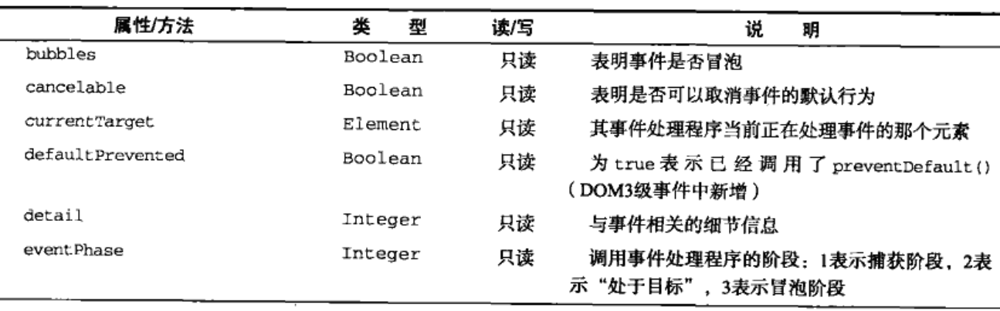
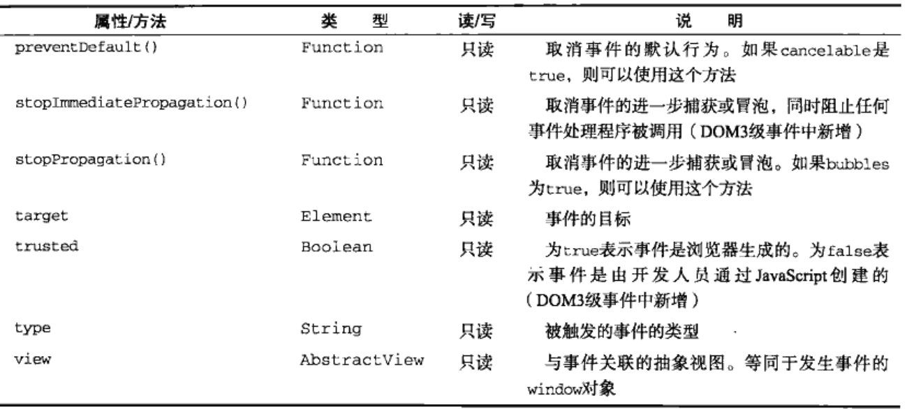

###事件对象
在触发DOM上的某个事件时,会产生一个`事件对象event`,该对象中包含所有与事件有关的信息.包括导致事件的元素,事件的类型以及其他与特定事件相关的信息.例如,鼠标操作导致的事件对象中,会包括鼠标位置的信息.键盘操作导致的事件对象中,会包含于按下的键有关的信息.

####DOM中的事件对象
兼容DOM的浏览器会将一个event对象传入到事件处理程序中.无论指定事件处理程序时使用什么方法(DOM0级或DOM2级),都会传入event对象

event对象包含与创建它的特定事件有关的属性和方法.触发的事件类型不同,可用的属性和方法也不同.不过,所有事件都会有下表列出的成员





- 在事件处理程序内部,对象this始终等于`currentTarget`的值(注册事件的那个节点),而`target`则只包含事件的实际目标(事发节点)

```javascript
var oBtn = document.querySelector("button")

oBtn.onclick = function(event){
    console.log( event.currentTarget === this ) //true
    console.log( event.target === this ) //true
}
```

```javascript
document.body.onclick = function(event){
    console.log( event.currentTarget === document.body ) //true
    console.log( event.currentTarget === this ) //true
    console.log( event.target === document.body ) //false
}
```

在需要通过一个函数处理多个事件时,可以使用type属性: 

```javascript
var oDiv = document.querySelector("div")

function handler(event){
    switch(event.type){
        case "click":
            alert("Clicked")
            break
        case "mouseover":
            event.target.style.color = "red"
            break
        case "mouseout":
            event.target.style.color = "yellow"
            break
    }
}

oDiv.onclick = handler
oDiv.onmouseover = handler
oDiv.onmouseout = handler
```

- 要阻止特定事件的默认行为,可以使用`event.preventDefault()`方法.例如,链接的默认行为就是在单击时会导航到其href特性指定的URL.例如点击拖动图片,会有一层虚影.这些都是默认行为.当通过阻止默认行为,那么链接不再调整,图片不再有虚影.只有`cancelable`属性设置为true的事件,才可以使用preventDefault()来取消默认行为

- `event.stopPropagation()`方法用于立即停止事件在DOM层次中的传播,即取消进一步的事件捕获或冒泡

- 事件对象的`event.eventPhase`属性,可以用来确定事件当前正位于事件流的哪个阶段.如果在捕获阶段调用的事件处理程序,那么eventPhase等于1;如果事件处理程序处于目标对象上,则eventPhase等于2;如果是在冒泡阶段调用事件处理程序,eventPhase等于3.这里注意,虽然目标阶段属于冒泡阶段,但是eventPhase值依然不同

只有在事件处理程序执行期间,event对象才会存在;一旦事件处理程序执行完成,event对象就会被销毁
