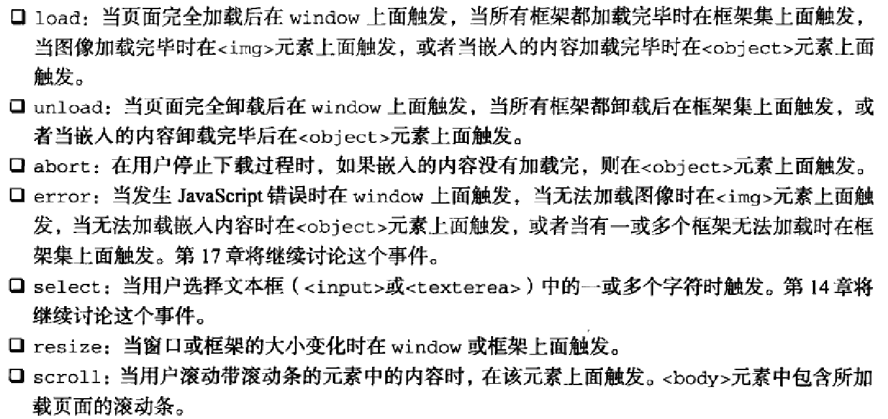

###UI事件
UI事件指的是那些不一定与用户操作有关的事件,现有UI事件如下图:



####load事件
JS中最常用的一个事件就是load.当页面完全加载后(包括所有`图像`,`JS文件`,`CSS文件`等外部资源),就会触发window上面的load事件

在创建新的``元素时,可以为其制定一个事件处理程序,以便图片加载完毕后给出提示.但给``加load事件需要注意几个方面

- load事件是紧跟着加载的.如果加载完毕不触发load事件,load事件不再触发

```html
<!DOCTYPE html>
<html lang="en">
<head>
    <meta charset="UTF-8">
    <title>Document</title>
    <style>
        
    </style>
</head>
<body>
    

    <script>
        window.onload = function(){
            var oImg = document.querySelector('img')
            oImg.onload = function(){
                alert(1)
            }
        }
        //这里图片加载完后,并不会弹出弹框
        //因为load事件是对应的某个东西,一加载完就立即执行,而这里有window.onload,所以当img一加载完,window.onload并不会执行,而当window.onload执行的时候,img的load事件已经不存在,无从谈起
    </script>
</body>
</html>
```

- ``元素必须先注册load事件,再指定src属性

```javascript
EventUtil.addHandler(window, "load", function(){
    var image = document.createElement("img")
    EventUtil.addHandler(image, "load", function(event){
        event = EventUtil.getEvent(event)
        alert(EventUtil.getTarget(event).src)
    })
    document.body.appendChild(image)
    image.src = "smile.gif"          
})
```

```javascript
EventUtil.addHandler(window, "load", function(){
    var image = new Image()
    EventUtil.addHandler(image, "load", function(event){
        alert("Image loaded!")
    })
    image.src = "smile.gif"        
})
```

- 因为当image的src发生改变,浏览器就会跑去加载这个src里的资源.这个操作是异步的,就是说,js不会傻傻地在原地等待图片的加载,而是继续读代码,直到图片加载完成,触发onload事件,js才会回来执行onload里面的内容.

- 那么问题来了,假如你家的网速好到爆,比光速还快,或者图片超级小,或者图片有缓存,反正就是,当图片加载的速度快于js解释器阅读代码的速度,然后你的onload是写在.src后面,浏览器还没读onload里面的全部内容就触发了onload事件...这就很尴尬了,浏览器根本不知道接下来要做什么,索性就什么都不做...所以onload要先写在.src前面,就是先告诉浏览器：待会要是onload,你就执行这些这些,知道了吗?好了,我要放src了,记得onload的时候执行函数啊!

`<script>`也支持load事件

####unload事件
与load事件对应的是unload事件,该事件在文档被完全卸载后触发.只要用户从一个页面切换到另一个页面,就会发生unload事件.

- 点击某个离开页面的链接 
- 在地址栏中键入了新的 URL 
- 使用前进或后退按钮 
- 关闭浏览器 
- 重新加载页面

```javascript
EventUtil.addHandler(window, "unload", function(event){
    alert("Unloaded")
})
```

需要注意的是*unload事件在火狐和Chrome中对alert是阻止弹出的*

利用该事件最多的情况是清除引用,以避免内存泄漏

####abort事件
当视频/音频(audio/video)或者图像(img)终止加载时触发

*是终止加载时触发,不是发生错误时触发*

####resize事件
当浏览器窗口被调整到一个新的高度或宽度时,就会触发resize事件.该事件在window(窗口)上面触发,因此可以通过JS或者`<body>`元素中的onresize特性来指定事件处理程序.

IE,Safari,Chrome,Opera会在浏览器窗口变化了1px时就触发resize事件,然后随着变化不断重复触发事件.Firefox则只会在用户停止调整窗口大小时候才会触发resize事件

浏览器窗口最小化或最大化时也会触发resize事件

####scroll事件
虽然scroll事件是在window对象上发生的,但它实际表示的则是页面中相应元素的变化

- chrome: window/document.body
- Firefox: window/document.body
- IE: document.documentElement/window
- Safari: window

