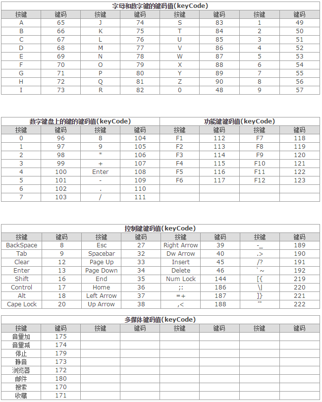

###键盘和文本事件
三个键盘事件:

- keydown: 当用户按下键盘上的任意键时触发,而且如果按住不放,会重复触发

- keypress: 当用户按下键盘上的字符键时触发,而且如果按住不放,会重复触发.按下Esc键也会触发该事件.

- keyup: 当用户释放键盘上的键时触发

所有元素都支持以上事件

在用户按了一下键盘上的字符键时,首先会触发keydown事件,然后紧跟着是keypress事件,最后是触发keyup事件.**_其中keydown和keypress都是在文本框发生变化之前被触发的;keyup事件则是在文本框已经发生变化之后被触发_**

键盘事件与鼠标事件一样,都支持相同的修改键.而且,键盘事件的事件对象中也有shiftKey,ctrlKey,altKey,metaKey属性

字符键包括: 

- 数字(注意: 包括Shift+数字的符号)
- 字母(注意: 包括大小写)
- 小键盘等除了F1-12,SHIFT,Alt,Ctrl,Insert,Home,PgUp,Delete,End,PgDn,ScrollLock,Pause,NumLock,{菜单键},{开始键}和方向键外的ANSI字符

只有一个文本事件: `textInput`.该事件是对keypress的补充,用意在将文本显示给用户之前更容易拦截文本.在文本插入文本框之前会触发textInput事件

IOS版Safari和Android版Webkit在使用屏幕键盘时会触发键盘事件

####键码
在发生keydown和keyup事件时,event对象的keyCode属性中会包含一个键码,与键盘上一个特定的键对应.对数字字母字符键,keyCode属性的值与ASCII码对应小写字母和数字的编码相同.

无论keydown或keyup事件都会存在的一些特殊情况.在Firefox和Opera中,按分号键时keyCode值为59,也就是ASCII中分号的编码;但其他浏览器会返回186,即键盘中按键的键码

####字符编码
发生keypress事件意味着按下的键会影响到屏幕中文本的显示.在所有浏览器中,按下能够插入或删除字符的键都会触发keypress事件.

主流浏览器都支持event对象中叫做`charCode`属性,该属性只在发生keypress事件才包含值,而且该值是按下的那个键所代表字符的ASCII编码.

**_keyCode是键码,charCode是字符编码_**

得到了charCode之后,就可以使用String.fromCharCode()将其转换成实际的字符

####textInput事件
"DOM3级事件"中引入名叫`textInput`事件.当用户在可编辑区域中输入字符时,就会触发该事件.这个用于替代keypress的textInput事件的行为稍有不同:

- 任何可以获得焦点的元素都可以触发keypress事件,但只有可编辑区域才能触发textInput事件.

- textInput事件只会在用户按下能够输入实际字符的键时才会被触发,而keypress事件则在按下那些能够影响文本像是的键时才会触发(如Esc键)

由于textInput事件主要考虑的是字符,因此它的event对象中还包含一个data属性,该属性的值就是用户输入的字符(不是字符编码).换句话说,用户在没有按上档键的情况下按下S键,data值为s,否则值为S

支持IE9+,Safari,Chrome

