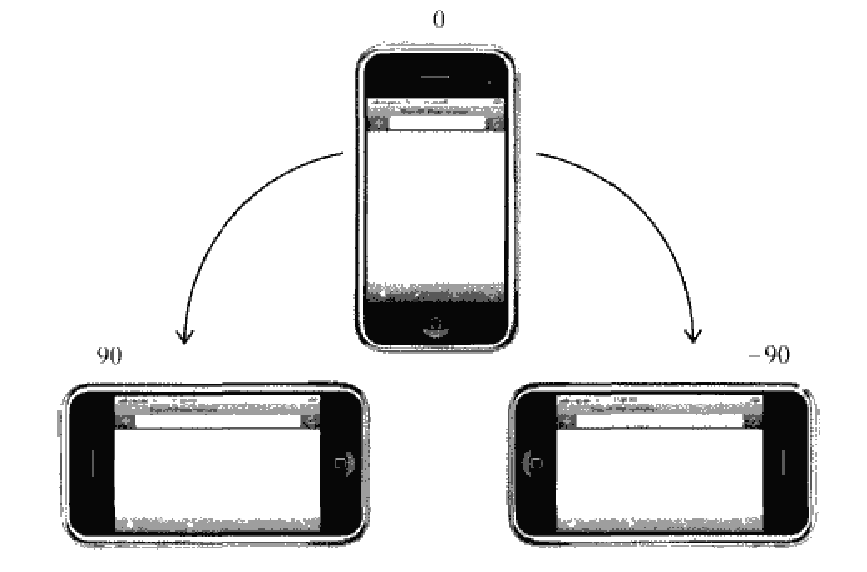
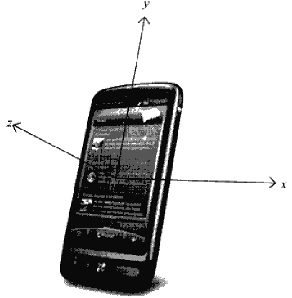
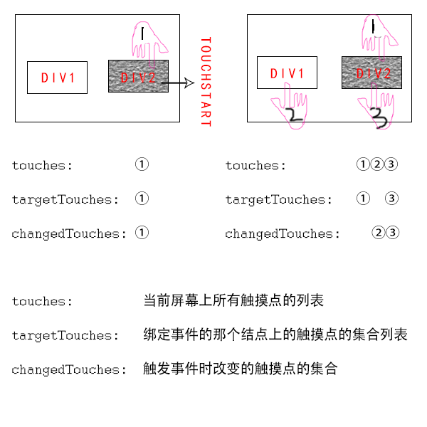
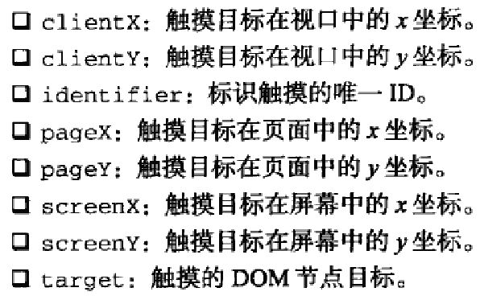

###设备事件(device event)
设备事件应用于智能手机和平板电脑中的浏览器里,可以让开发人员确定用户在怎样使用设备.

####orientationchange事件
苹果公司为移动Safari中添加了`orientationchange`事件,以便开发人员能够确定用户把设备调整为横向模式还是纵向模式.移动Safari的`window.orientation`属性可能包含3个值:

- 0: 表示肖像模式(即正常纵向模式)

- 90: 表示左旋转的横向模式

- -90: 表示右旋转的横向模式



只要用户改变了设备的查看模式,就会触发orientationchange事件.

####deviceorientation事件和devicemotion事件
- deviceorientation

可以理解为方向事件.它在加速计检测到设备方向变化时在window对象上触发.`deviceorientation`事件的意图是告诉开发人员设备在空间中朝向哪儿.它的三维方向值是设备坐标系与地球坐标系的差值

设备在三维空间中是靠x,y,z轴来定位的.当设备静止放在水平表面时,这三个值都是0.x轴方向从左向右,y轴方向从下到上,z轴方向从后向前



触发deviceorientation事件时,事件对象中包含着每个轴相对于设备静止状态下发生变化的信息:

- alpha: 围绕z轴旋转(即左右旋转),y轴的度数差.是一个介于0到360之间的浮点数

- beta: 围绕x轴旋转(即前后旋转),z轴的度数差.是一个介于-180到180之间的浮点数

- gamma: 围绕y轴旋转(即扭转设备时),z轴的度数差.是一个介于-90到90之间的浮点数

- absolute: 布尔值,表示设备是否返回一个绝对值

- compassCalibrated: 布尔值,表示设备的指南针是否校准过

```html
<!DOCTYPE html>
<html>
<head>
    <title>Device Orientation Event Example</title>
    <script type="text/javascript" src="EventUtil.js"></script>
    <style>
        #arrow{
            background: #000;
            width: 3px;
            height: 300px;
            margin: 0 auto;
        }
    </style>
</head>
<body>
    <p>This example only works in Chrome in devices such as Macbooks, Thinkpads, or Android, or on Safari for iOS 4.2+.</p>
    <div id="output"></div>
    <div id="arrow"></div>
    <script>
        EventUtil.addHandler(window, "deviceorientation", function(event){
            var output = document.getElementById("output")
            var arrow = document.getElementById("arrow")
            arrow.style.webkitTransform = "rotate(" + Math.round(event.alpha) + "deg)"
            output.innerHTML = "Alpha=" + event.alpha + ", Beta=" + event.beta + ", Gamma=" + event.gamma + "<br>" + event.absolute + "<br>" + event.compassCalibrated
        })
    </script>
</body>
</html>
```

- devicemotion

devicemotion是设备在空间中加速度方向的体现

关于deviceorientation和devicemotion的相关资料参考

[https://developer.mozilla.org/zh-CN/docs/Web/API/Detecting_device_orientation](https://developer.mozilla.org/zh-CN/docs/Web/API/Detecting_device_orientation)

[https://developer.mozilla.org/zh-CN/docs/Web/Guide/Events/Orientation_and_motion_data_explained](https://developer.mozilla.org/zh-CN/docs/Web/Guide/Events/Orientation_and_motion_data_explained)

####触摸与手势事件
触摸事件会在用户手指放在屏幕上面时,在屏幕上滑动时或从屏幕上移开时触发.

- touchstart: 当用户触摸屏幕时触发.即使已经有一个手指放在了屏幕上也会触发

- touchmove: 当手指在屏幕上滑动时连续触发.在该事件发生期间,调用preventDefault()可以阻止滚动

- touchend: 当手指从屏幕上移开时触发

- touchcancel: 当系统停止跟踪触摸时触发,如触控发生失效时(太多触控点);当更高级事件发生时(电话接入或弹出信息)会取消当前touch操作.一般会在ontouchcancel事件发生时,暂停游戏,或存档操作

以上事件都能冒泡,也能取消

触摸事件还包含三个用于跟踪触摸的属性

- touches: 当前屏幕上所有触摸点的集合列表

- targetTouches: 绑定事件的那个结点上的触摸点的集合列表

- changeTouches: 触发事件时改变的触摸点的集合

举例来说,比如div1, div2只有div2绑定了touchstart事件,第一次放下一个手指在div2上,触发了touchstart事件,这个时候,三个集合的内容是一样的,都包含这个手指的touch.然后,再放下两个手指一个在div1上,一个在div2上.这个时候又会触发事件,但changedTouches里面只包含第二个第三个手指的信息,因为第一个没有发生变化,而targetTouches包含的是在第一个手指和第三个在div2上的手指集合,touches包含屏幕上所有手指的信息,也就是三个手指



每个touch对象包含下列属性:



touchend事件会输出有关触摸操作的最终信息.

**_注意,在touchend事件发生时,touches集合中就没有任何Touch对象了,因为不存在活动的触摸操作,此时,就必须转用changeTouches集合_**

事件发生顺序:

- touchstart
- mouseover
- mousemove(一次)
- mousedown
- mouseup
- click
- touchend


