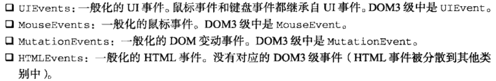
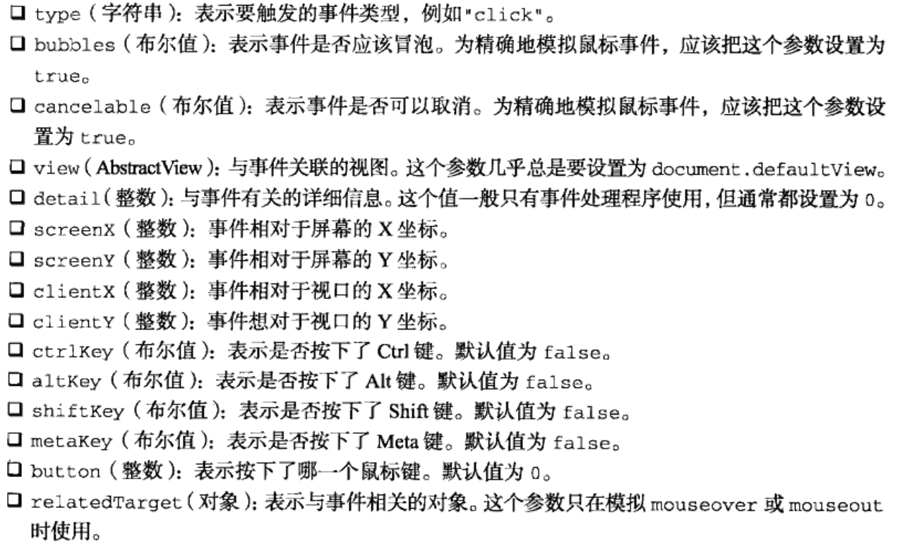
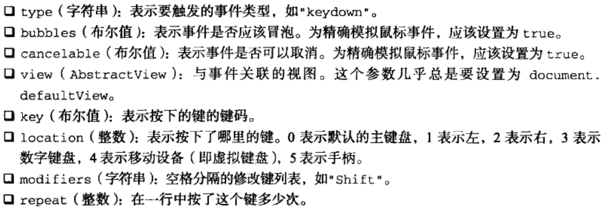
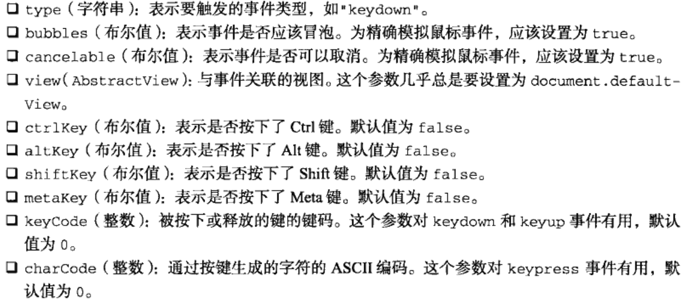

###模拟事件
可以使用JS在任意时刻来触发特定的事件,而此时的事件就如同浏览器创建的事件一样.也就是说,这些事件该冒泡还会冒泡,而且照样能够导致浏览器执行已经指定的处理它们的事件处理程序.在测试Web应用程序,模拟触发事件是一种极其有用的技术

####DOM中的事件模拟
可以在`document`对象上使用`createEvent()`方法创建event对象.该方法接收一个参数,即要表示要创建的事件类型的字符串.在DOM2级中,所有这些字符串都使用英文复数形式,而在DOM3级中都变成了单数.这个字符串可以是下列几个字符串之一



在创建了event对象之后,还需要使用与事件有关的信息对其进行初始化.每种类型的event对象都有一个特殊的方法,为它传入适当的数据就可以初始化该event对象.不同类型的这个方法的名字也不相同,具体要取决于`createEvent()`中使用的参数

模拟事件的最后一步就是触发事件.这一步需要使用`dispatchEvent()`方法,所有支持事件的DOM节点都支持该方法.调用`dispatchEvent()`方法时,需要传入一个参数,即表示要触发事件的event对象.触发事件之后,该事件就跻身`官方事件`之列了,因而能够照样冒泡并引发相应事件处理程序的执行

#####模拟鼠标事件
创建新的鼠标事件对象并为其指定必要的信息,就可以模拟鼠标事件.创建鼠标事件对象的方法是为`createEvent()`传入字符串`MouseEvents`.返回的对象有一个名为`initMouseEvent()`方法,用于指定与该鼠标事件有关的信息.该方法接收15个参数,这些参数含义如下:



以上参数中前四个对正确激发事件至关重要,因为浏览器要用到这些参数;而剩下的所有参数只有在事件处理程序中才会用到.当把event对象传给`dispatchEvent()`方法时,这个对象的`target`属性会自动设置

```html
<!DOCTYPE html>
<html lang="en">
<head>
    <meta charset="UTF-8">
    <title>Document</title>
</head>
<body>
    <button class="btn1">click1</button>
    <button class="btn2">click2</button>

    <script>
        var btn1 = document.querySelector('.btn1'),
            btn2 = document.querySelector('.btn2')

        btn1.onclick = function(event){
            console.log('clicked')
            console.log(event.screenX)
        }

        btn2.onclick = function(){
            var event = document.createEvent('MouseEvents')

            event.initMouseEvent('click', true, true, document.defaultView, 0, 100, 0, 0, 0, false, 
                                 false, false, false, 0, btn2)

            btn1.dispatchEvent(event)
        }
    </script>
</body>
</html>
```

#####模拟键盘事件
DOM3级规定,调用`createEvent()`并传入`KeyboardEvent`就可以创建一个键盘事件.返回事件对象会包含一个`initKeyEvent()`方法,该方法接收下列参数



**_注意,由于DOM3级不提倡使用keypress事件,因此只能利用该技术来模拟keydown和keyup事件_**

在Firefox中,调用`createEvent()`并传入`KeyEvents`就可以创建一个键盘事件.返回的事件对象会包含一个`initKeyEvent()`方法,该方法接收下列10个参数



在其他浏览器中,则需要创建一个通用的事件,然后再向事件对象中添加键盘事件特有的信息.

```html
<!DOCTYPE html>
<html>
<head>
    <title>Simulating DOM Keyboard Events Example</title>
    <script type="text/javascript" src="EventUtil.js"></script>
</head>
<body>
    <input type="text" value="" id="myTextbox" />
    <input type="button" value="Send keydown to the textbox" id="myBtn" />
    <script type="text/javascript">
    
    (function(){
        var btn = document.getElementById("myBtn")
        var textbox = document.getElementById("myTextbox")
        
        EventUtil.addHandler(textbox, "keydown", function(event){
            alert(event.type)
            alert(event.keyCode)
        })

        EventUtil.addHandler(btn, "click", function(event){

            //create event object
            var event
            
            //DOM Level 3 implementation
            if (document.implementation.hasFeature("KeyboardEvent", "3.0")){
                event = document.createEvent("KeyboardEvent")
                // event.initKeyboardEvent("keydown", true, true, "a", 0, "Shift")
                event.initKeyboardEvent("keydown", true, true, true, 0, "Shift") 
            } else {
                try {
                    //Firefox implementation
                    event = document.createEvent("KeyEvents")
                    event.initKeyEvent("keydown", true, true, document.defaultView, false, false, 
                                        true, false, 65, 65)
                } catch (ex){ //others
                    event = document.createEvent("Events")
                    event.initEvent("keydown", true, true)
                    event.view = document.defaultView
                    event.altKey = false
                    event.ctrlKey = false
                    event.shiftKey = false
                    event.metaKey = false
                    event.keyCode = 65
                    event.charCode = 65         
                }               
                
                
            }
            
            //fire the event
            textbox.dispatchEvent(event)

        })

    })()
    </script>
</body>
</html>
```
