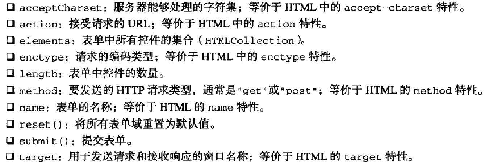
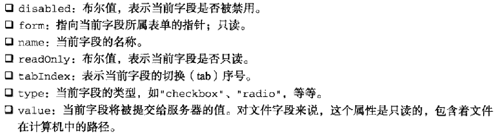
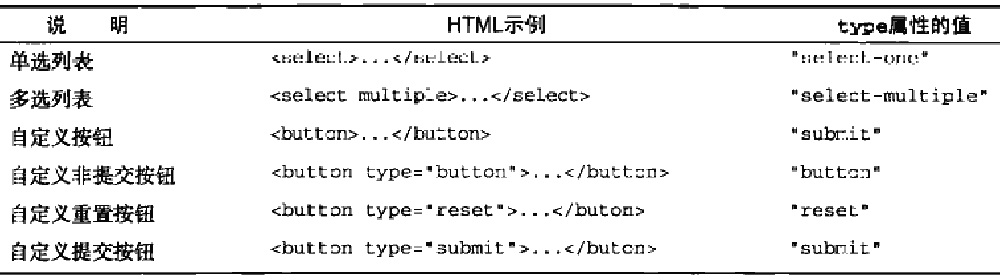

###表单的基础知识
在HTML中,表单是由`<form>`元素来表示的,而在JS中,表单对应的则是`HTMLFormElement`类型.`HTMLFormElement`继承了`HTMLElement`,因而与其他HTML元素具有相同的默认属性.不过,`HTMLFormElement`也有它独有的属性和方法:



取得`<form>`元素引用的两种基本方式

- var form = document.getElementById("form1")

- document.forms

通过document.forms可以取得页面中所有的表单.在该集合中,可以通过数值索引或name值来取得特定的表单

####提交表单
用户单击提交按钮或图像按钮时(以下为提交按钮和图像按钮),就会提交表单.

```html
<input type="submit" value="Submit Form">

<button type="submit">Submit Form</button>

<input type="image" src="#">
```

只要表单中存在上面列出的任何一种按钮,那么在相应表单控件(不包括文本域控件)拥有焦点的情况下,按回车键就可以提交该表单

用提交按钮或者图像按钮提交表单时,浏览器会在将请求发送给服务器之前触发submit事件.这样,就有机会验证表单数据了,并据以决定是否允许表单提交.阻止该事件的默认行为就可以取消表单提交.例如:

```javascript
document.forms[0].onsubmit = function(event){
    //这里可以验证表单

    event.preventDefault()//这个是取消表单提交
}
```

在JS中,以编程方式调用`submit()`方法也可以提交表单.而在,这种方式无需表单包含提交按钮,任何时候都可以正常提交表单

```javascript
var form = document.getElementById("myForm")

form.submit()
```

**_用`submit()`方法的形式提交表单时,不会触发submit事件,因此要记得在调用此方法之前先验证表单数据_**

提交表单时可能出现的最大问题,就是重复提交表单.解决该问题有两种方法:

- 在第一次提交表单后就禁用提交按钮

- 利用onsubmit事件处理程序取消后续的表单提交操作


点提交按钮,提交的数据格式

```html
<form action="#" method="post">
    <input type="text" name="username">

    <input type="password" name="password">

    <input type="submit" value="登录">
</form>
```

当点击登陆时,向数据库发生的数据是: username=username&password=password


####重置表单
在用户单击重置按钮时,表单会被重置.

```html
<input type="reset" value="Reset Form">

<button type="reset">Reset Form</button>
```

以上两个按钮都可以用来重置表单.在重置表单时,所有表单字段都会恢复到页面刚加载完毕时的初始值.

用户单击重置按钮时会触发`reset`事件.可以通过阻止默认事件来取消重置操作

```javascript
document.forms[0].onreset = function(event){
    event.preventDefault()
}
```

与提交表单一样,也可以通过JS来重置表单

```javascript
var form = document.getElementById("myForm")

form.reset()
```

**_与调用submit()方法不同的是,调用reset()方法会像单击重置按钮一样触发reset事件_**

####表单字段
每个表单都有`element`属性,该属性是表单中所有表单元素(字段)的集合.这个`element`集合是一个有序列表,其中包含着表单中的所有字段.可以按照位置索引或者name特性来访问它们

如果有多个表单控件都在使用一个name(如单选按钮),那么就会返回以该name命名的一个NodeList.如下:

```html
<!DOCTYPE html>
<html>
<head>
    <title>Form Fields Example</title>
    <script type="text/javascript" src="EventUtil.js"></script>
</head>
<body>
    <form method="post" id="myForm">
        <ul>
            <li><input type="radio" name="color" value="red">Red</li>
            <li><input type="radio" name="color" value="green">Green</li>
            <li><input type="radio" name="color" value="blue">Blue</li>
        </ul>
    </form>     
    <script type="text/javascript">
        var form = document.getElementById("myForm")
        
        var colorFields = form.elements["color"]
        alert(colorFields.length)  //3
        
        var firstColorField = colorFields[0]
        var firstFormField = form.elements[0]
        alert(firstColorField === firstFormField)   //true
    </script>
</body>
</html>
```

#####共有的表单字段属性
除了`<fieldset>`元素外,所有表单字段都拥有相同的一组属性.由于`<input>`类型可以表示多种表单字段,因此有些属性只适用于某些字段,但还有一些属性是所有字段所共有的.如下:



在上面提交按钮中提及的防止重复点击提交按钮的第一个解决方法: 第一次单击提交按钮后就禁用提交按钮

```javascript
document.forms[0].onsubmit = function(event){
    event.target.elements["btn"].disabled = true
}
```

以上代码为表单的submit事件添加了一个事件处理程序.事件触发后,代码取得了提交按钮并将其disabled属性设置为true.

**_注意,以上逻辑不能通过onclick事件处理程序来实现,原因是不同浏览器之间存在"时差":有的浏览器会在触发表单的submit事件之前触发click事件,而有的浏览器则相反.对于先触发click事件的浏览器,意味着会在提交表单之前禁用按钮,结果表单不会被提交.因此,最好通过submit事件来禁用提交按钮.不过,该方法不适合表单中不包括提交按钮的情况_**

除了`<fieldset>`之外,所有表单字段都有`type`属性.对于`<input>`元素,该值等于HTML特性type的值,对于其他元素,这个type属性值如下:



`<input>`和`<button>`元素的type属性可以动态修改,而`<select>`元素的type属性则是只读

#####共有的表单字段方法
每个表单字段都有两个方法: `focus()`和`blur()`.

**_如果表单字段是一个'<input>'元素,且其type特性的值为"hidden"或者使用CSS的display和visibility属性隐藏了该字段,那么focus()方法会出错_**

HTML5为表单字段新增了一个`autofocus`属性.只要设置该属性,不用JS就能自动把焦点移动到相应字段

`<input type="text" autofocus>`

在JS中,autofocus是一个布尔值属性,`input.autofocus`,在支持该属性的浏览器中它的值为布尔值(不支持的浏览器则为空字符串)

IE9不支持

####共有的表单字段事件
除了支持鼠标,键盘,更改和HTML事件之外,所有表单都支持下列3个事件:

- blur: 当前字段失去焦点时触发

- focus: 当前字段获得焦点时触发

- change: 对于`<input>`和`<textarea>`元素,它们在失去焦点且value值改变时候触发;对于`<select>`,只要其选项改变就触发

**_关于blur和change事件,并没有规定触发的先后顺序_**