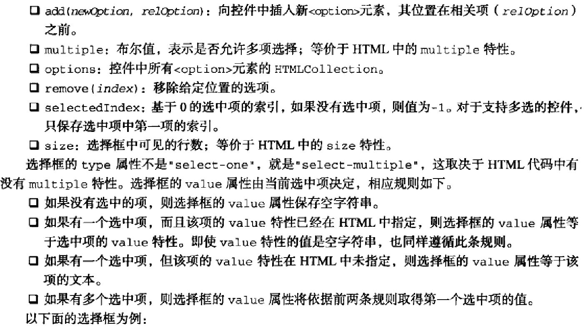
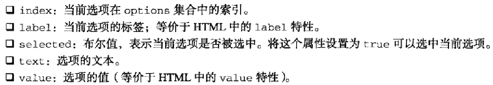

###选择框脚本
选择框是通过`<select>`和`<option>`元素创建的.为便于控件交互,除了所有表单字段共有的属性和方法外,`HTMLSelectElement`类型还提供了下列属性和方法:



上图中的`selectedIndex`特性指的是被选中的项的索引值

上图中所写,选择框中type属性不是`select-one`就是`select-multiple`,这取决于HTML中是否有`multiple`特性.不能撇开设置`multiple`特性,而直接设置type属性值

```html
<select>
    <option value="yzd1">111</option>
    <option value="">222</option>
    <option>333</option>
</select>
```

上述代码,如果用户选择第一项,那么`<select>`的value值为yzd1;如果选择第二项,值为空字符串;如果为第三项,值为333

在DOM中,每个`<option>`元素都有一个`HTMLOptionElement`对象表示.为便于访问数据,`HTMLOptionElement`对象添加了下列属性:



在操作选项时,推荐使用特定于选项的属性,因为所有浏览器都支持这些属性.在将表单控件作为DOM节点的情况下,实际的交互方式则会因浏览器而异.

不推荐写法:

```javascript
var selectbox = document.forms[0].elements['location']

var text = selectbox.options[0].firstChild.nodeValue
```

推荐写法:

```javascript
var selectbox = document.forms[0].elements['location']

var text = selectbox.options[0].text
```

####添加选项

- 方法一

```javascript
var newOption = document.createElement("option")
newOption.appendChild(document.createTextNode('Option text'))
newOption.setAttribute("value", 'Option value')

selectbox.appendChild(newOption)
```

- 方法二

```javascript

```


