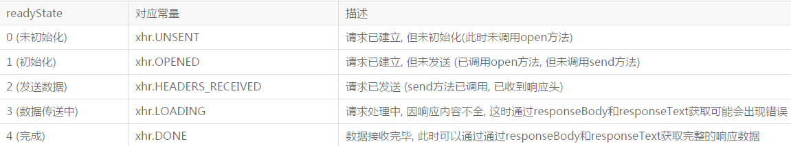
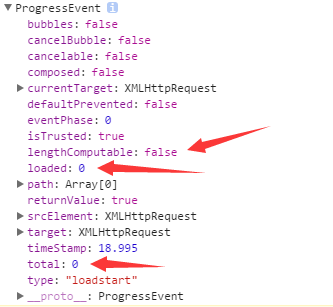

###Ajax知识体系大梳理
转自[http://louiszhai.github.io/2016/11/02/ajax/](http://louiszhai.github.io/2016/11/02/ajax/)

`Ajax` 全称 `Asynchronous JavaScript and XML`, 即异步JS与XML. 它最早在IE5中被使用, 然后由Mozilla, Apple, Google推广开来. 典型的代表应用有 Outlook Web Access, 以及 GMail. 现代网页中几乎无ajax不欢. 前后端分离也正是建立在ajax异步通信的基础之上

####浏览器实现ajax的两种技术方式:

- 标准浏览器通过 `XMLHttpRequest` 对象实现了ajax的功能. 只需要通过一行语句便可创建一个用于发送ajax请求的对象

`var xhr = new XMLHttpRequest()`

-  IE浏览器通过 `XMLHttpRequest` 或者 `ActiveXObject` 对象同样实现了ajax的功能.

`IE7`及更高版本浏览器可以直接使用BOM的 `XMLHttpRequest` 对象.复辟历史,终会被历史的车轮所碾压,所以,这里将抛弃`IE6`及以下`ajax`技术`ActiveXObject`的讨论

####ajax有没有破坏js单线程机制
对于这个问题, 我们先看下浏览器线程机制. 一般情况下, 浏览器有如下四种线程:

- GUI渲染线程

- javascript引擎线程

- 浏览器事件触发线程

- HTTP请求线程

那么这么多线程, 它们究竟是怎么同`js引擎`线程交互的呢?

通常, 它们的线程间交互以事件的方式发生, 通过事件回调的方式予以通知. 而事件回调, 又是以先进先出的方式添加到`任务队列` 的末尾 , 等到`js引擎`空闲时, `任务队列` 中排队的任务将会依次被执行. 这些事件回调包括 setTimeout, setInterval, click, ajax异步请求等回调

**_浏览器中, js引擎线程会循环从 `任务队列 `中读取事件并且执行, 这种运行机制称作 Event Loop (事件循环)._**

对于一个ajax请求, `js引擎`首先生成`XMLHttpRequest`实例对象, open过后再调用send方法. 至此, 所有的语句都是同步执行. 但从send方法内部开始, 浏览器为将要发生的网络请求创建了新的`http请求线程`, 这个线程独立于`js引擎`线程, 于是网络请求异步被发送出去了. 另一方面, `js引擎`并不会等待 ajax 发起的http请求收到结果, 而是直接顺序往下执行.

当ajax请求被服务器响应并且收到response后, `浏览器事件触发线程`捕获到了ajax的回调事件 onreadystatechange (当然也可能触发onload, 或者 onerror等等) . 该回调事件并没有被立即执行, 而是被添加到 任务队列 的末尾. 直到js引擎空闲了, 任务队列 的任务才被捞出来, 按照添加顺序, 挨个执行, 当然也包括刚刚append到队列末尾的 onreadystatechange 事件.

在 onreadystatechange 事件内部, 有可能对dom进行操作. 此时浏览器便会挂起js引擎线程, 转而执行`GUI渲染线程`, 进行UI重绘(repaint)或者回流(reflow). 当js引擎重新执行时, GUI渲染线程又会被挂起, GUI更新将被保存起来, 等到js引擎空闲时立即被执行.

###什么是重绘和回流请看隔壁篇[repaint-reflow.md](repaint-reflow.md)

以上整个ajax请求过程中, 有涉及到浏览器的4种线程. 其中除了 `GUI渲染线程` 和 `js引擎线程` 是互斥的. 其他线程相互之间, 都是可以并行执行的. 通过这样的一种方式, ajax并没有破坏js的单线程机制

####ajax与setTimeout排队问题
通常, ajax 和 setTimeout 的事件回调都被同等的对待, 按照顺序自动的被添加到 任务队列 的末尾, 等待js引擎空闲时执行. 但请注意, 并非xhr的所有回调执行都滞后于setTImeout的回调

```javascript
function ajax(url, method) {
        var xhr = new XMLHttpRequest()
        xhr.onreadystatechange = function() {
            console.log('xhr.readyState:' + this.readyState)
        }
        xhr.onloadstart = function() {
            console.log('onloadStart')
        }
        xhr.onload = function() {
            console.log('onload')
        }
        xhr.open(method, url, true) //这里的true表示请求异步发送
        xhr.setRequestHeader('Cache-Control', 3600)
        xhr.send()
    }
    var timer = setTimeout(function() {
        console.log('setTimeout')
    }, 0)
    ajax('http://www.easy-mock.com/mock/590089cf875d7232a38b20d9/example/num', 'GET')
    console.warn('这里的log并不是最先打印出来的.')
```

控制台打印效果如下:

```javascript
xhr.readyState:1
onloadStart
这里的log并不是最先打印出来的.
setTimeout
xhr.readyState:2
xhr.readyState:3
xhr.readyState:4
onload
```

由于ajax异步, setTimeout回调本应该最先被执行, 然而实际上, 一次ajax请求, 并非所有的部分都是异步的, 至少”readyState==1”的 onreadystatechange 回调以及 onloadstart 回调就是同步执行的. 因此它们的输出排在最前面.

####XMLHttpRequest属性/方法解读
通常, 一个xhr实例对象拥有10个普通属性+9个方法

#####readyState
只读属性, readyState属性记录了ajax调用过程中所有可能的状态. 它的取值简单明了, 如下:



注意, `readyState` 是一个只读属性, 想要改变它的值是不可行的

#####onreadystatechange
`onreadystatechange`事件回调方法在`readystate`状态改变时触发, 在一个收到响应的ajax请求周期中, `onreadystatechange` 方法会被触发4次(1,2,3,4). 因此可以在 onreadystatechange 方法中绑定一些事件回调

```javascript
xhr.onreadystatechange = function(e){
    if(xhr.readystate==4){
        var s = xhr.status
        if((s >= 200 && s < 300) || s == 304){
            var resp = xhr.responseText
            //TODO ...
        }
    }
}
```

**_onreadystatechange回调中默认会传入Event实例_**

#####status
只读属性, status表示http请求的状态, 初始值为0. 如果服务器没有显式地指定状态码, 那么status将被设置为默认值, 即200

#####statusText
只读属性, statusText表示服务器的响应状态信息, 它是一个 UTF-16 的字符串, 请求成功且status==20X时, 返回大写的 OK. 请求失败时返回空字符串. 其他情况下返回相应的状态描述. 比如: 301的 Moved Permanently , 302的 Found , 303的 See Other , 307 的 Temporary Redirect , 400的 Bad Request , 401的 Unauthorized 等等

#####onloadstart
`onloadstart`事件回调方法在ajax请求发送之前触发, 触发时机在 `readyState==1` 状态之后, `readyState==2` 状态之前

`onloadstart`方法中默认将传入一个`ProgressEvent`事件进度对象. 如下:



`ProgressEvent`对象具有三个重要的只读属性.已在上图红箭头标出

- `lengthComputable`: 表示长度是否可计算, 它是一个布尔值, 初始值为false
- `loaded`: 表示已加载资源的大小, 如果使用http下载资源, 它仅仅表示已下载内容的大小, 而不包括http headers等. 它是一个无符号长整型, 初始值为0.
- `total`: 表示资源总大小, 如果使用http下载资源, 它仅仅表示内容的总大小, 而不包括http headers等, 它同样是一个无符号长整型, 初始值为0

#####onprogress
`onprogress`事件回调方法在 `readyState==3` 状态时开始触发, 默认传入 `ProgressEvent` 对象, 可通过 `e.loaded/e.total` 来计算加载资源的进度, 该方法用于获取资源的下载进度

**_注意: 该方法适用于 IE10+ 及其他现代浏览器_**

```javascript
xhr.onprogress = function(e){
  console.log('progress:', e.loaded/e.total);
}
```

####onload
onload事件回调方法在ajax请求成功后触发, 触发时机在 `readyState==4` 状态之后

想要捕捉到一个ajax异步请求的成功状态, 并且执行回调, 一般下面的语句就足够了:

```javascript
xhr.onload = function(){
    var status = xhr.status
    if(status >= 200 && status <= 300){
        console.log(xhr.responseText)
    }
}
```

#####onloadend
onloadend事件回调方法在ajax请求完成后触发, 触发时机在 `readyState==4` 状态之后(收到响应时) 或者 `readyState==2` 状态之后(未收到响应时)

loadend方法中默认将传入一个ProgressEvent事件进度对象

#####timeout
timeout属性用于指定ajax的超时时长. 通过它可以灵活地控制ajax请求时间的上限. timeout的值满足如下规则:

- 通常设置为0时不生效.
- 设置为字符串时, 如果字符串中全部为数字, 它会自动将字符串转化为数字, 反之该设置不生效.
- 设置为对象时, 如果该对象能够转化为数字, 那么将设置为转化后的数字.

```javascript
xhr.timeout = 0; //不生效
xhr.timeout = '123'; //生效, 值为123
xhr.timeout = '123s'; //不生效
xhr.timeout = ['123']; //生效, 值为123
xhr.timeout = {a:123}; //不生效
```

#####ontimeout
ontimeout方法在ajax请求超时时触发, 通过它可以在ajax请求超时时做一些后续处理

```javascript
xhr.ontimeout = function(e) {
    console.error("请求超时!!!")
}
```

#####response responseText
均为只读属性, `response`表示服务器的响应内容, 相应的, `responseText`表示服务器响应内容的文本形式

#####responseXML
只读属性, `responseXML`表示`xml`形式的响应数据, 缺省为`null`, 若数据不是有效的`xml`, 则会报错

#####responseType
`responseType`表示响应的类型, 缺省为空字符串, 可取 "arraybuffer" , "blob" , "document" , "json" , and "text" 共五种类型

#####responseURL
`responseURL`返回ajax请求最终的URL, 如果请求中存在重定向, 那么`responseURL`表示重定向之后的URL.

#####withCredentials
withCredentials是一个布尔值, 默认为false, 表示跨域请求中不发送cookies等信息. 当它设置为true时, cookies , authorization headers 或者TLS客户端证书 都可以正常发送和接收. 显然它的值对同域请求没有影响.

**_注意: 该属性适用于 IE10+, opera12+及其他现代浏览器_**

#####abort
abort方法用于取消ajax请求, 取消后, `readyState` 状态将被设置为 0 (UNSENT). 如下, 调用abort 方法后, 请求将被取消

#####getResponseHeader
`getResponseHeader`方法用于获取ajax响应头中指定name的值. 如果response headers中存在相同的name, 那么它们的值将自动以字符串的形式连接在一起

`console.log(xhr.getResponseHeader('Content-Type'))`

#####getAllResponseHeaders
`getAllResponseHeaders`方法用于获取所有安全的ajax响应头, 响应头以字符串形式返回. 每个HTTP报头名称和值用冒号分隔, 如key:value, 并以\r\n结束.

```javascript
xhr.onreadystatechange = function() {
    if(this.readyState == this.HEADERS_RECEIVED) {
        console.log(this.getAllResponseHeaders());
    }
}
```

以上, `readyState === 2` 状态时, 就意味着响应头已接受完整. 此时便可以打印出完整的 response headers.

#####setRequestHeader
既然可以获取响应头, 那么自然也可以设置请求头, setRequestHeader就是干这个的. 如下:

```javascript
//指定请求的type为json格式
xhr.setRequestHeader("Content-type", "application/json")
//除此之外, 还可以设置其他的请求头
xhr.setRequestHeader('x-requested-with', '123456')
```

#####onerror
onerror方法用于在ajax请求出错后执行. 通常只在网络出现问题时或者ERR_CONNECTION_RESET时触发(如果请求返回的是407状态码, chrome下也会触发onerror).

#####upload
`upload`属性默认返回一个 `XMLHttpRequestUpload` 对象, 用于`上传资源`. 该对象具有如下方法:

- onloadstart
- onprogress
- onabort
- onerror
- onload
- ontimeout
- onloadend

上述方法功能同 xhr 对象中同名方法一致. 其中, onprogress 事件回调方法可用于跟踪资源上传的进度.

```javascript
xhr.upload.onprogress = function(e){
    var percent = 100 * e.loaded / e.total
    console.log('upload: ' + precent + '%')
}
```

#####overrideMimeType
overrideMimeType方法用于强制指定response 的 MIME 类型, 即强制修改response的 Content-Type . 如下, 服务器返回的response的 MIME 类型为 text/plain


```javascript
xhr.getResponseHeader('Content-Type');//"text/plain"
xhr.responseXML;//null
```

通过overrideMimeType方法将response的MIME类型设置为 text/xml;charset=utf-8 , 如下所示:

```javascript
xhr.overrideMimeType("text/xml; charset = utf-8")
xhr.send()
```

此时虽然 response headers 如上图, 没有变化, 但 Content-Type 已替换为新值.

```javascript
xhr.getResponseHeader('Content-Type')//"text/xml; charset = utf-8"
```

####XHR一级
XHR1 即 XMLHttpRequest Level 1. XHR1时, xhr对象具有如下缺点:

- 仅支持文本数据传输, 无法传输二进制数据.
- 传输数据时, 没有进度信息提示, 只能提示是否完成.
- 受浏览器 同源策略 限制, 只能请求同域资源.
- 没有超时机制, 不方便掌控ajax请求节奏.

####XHR二级
XHR2 即 XMLHttpRequest Level 2. XHR2针对XHR1的上述缺点做了如下改进:

- 支持二进制数据, 可以上传文件, 可以使用FormData对象管理表单.
- 提供进度提示, 可通过 xhr.upload.onprogress 事件回调方法获取传输进度.
- 依然受 同源策略 限制, 这个安全机制不会变. XHR2新提供 Access-Control-Allow-Origin 等headers, 设置为 * 时表示允许任何域名请求, 从而实现跨域CORS访问(有关CORS详细介绍请耐心往下读).
- 可以设置timeout 及 ontimeout, 方便设置超时时长和超时后续处理.

这里就H5新增的FormData对象举个例.

```javascript
//可直接创建FormData实例
var data = new FormData()
data.append("name", "yzd")
xhr.send(data)
//还可以通过传入表单DOM对象来创建FormData实例
var form = document.getElementById('form')
var data = new FormData(form)
data.append("password", "123456")
xhr.send(data)
```

目前, 主流浏览器基本上都支持XHR2, 除了IE系列需要IE10及更高版本. 因此IE10以下是不支持XHR2的.

那么问题来了,8,9的用户怎么办? 很遗憾, 这些用户是比较尴尬的. 对于IE8,9而言, 只有一个阉割版的 XDomainRequest 可用

####XDomainRequest
XDomainRequest 对象是IE8,9折腾出来的, 用于支持CORS请求非成熟的解决方案. 以至于IE10中直接移除了它, 并重新回到了 XMLHttpRequest 的怀抱.

XDomainRequest 仅可用于发送 GET和 POST 请求. 如下即创建过程.

`var xdr = new XDomainRequest()`

xdr具有如下属性:

- timeout
- responseText

如下方法:

- open: 只能接收Method,和url两个参数. 只能发送异步请求.
- send
- abort

如下事件回调:

- onprogress
- ontimeout
- onerror
- onload

除了缺少一些方法外, XDomainRequest 基本上就和 XMLHttpRequest 的使用方式保持一致

**_必须要明确的是:_**

- XDomainRequest 不支持跨域传输cookie.
- 只能设置请求头的Content-Type字段, 且不能访问响应头信息.

####ajax跨域请求
#####什么是CORS
CORS是一个W3C(World Wide Web)标准, 全称是跨域资源共享(Cross-origin resource sharing).它允许浏览器向跨域服务器, 发出异步http请求, 从而克服了ajax受同源策略的限制. 

实际上, 浏览器不会拦截不合法的跨域请求, 而是拦截了他们的响应, 因此即使请求不合法, 很多时候, 服务器依然收到了请求.(跨域并不一定是浏览器限制了发起跨站请求,而也可能是跨站请求可以正常发起,但是返回结果被浏览器拦截了.最好的例子是 CSRF 跨站攻击原理,请求是发送到了后端服务器无论是否跨域!注意: 有些浏览器不允许从 HTTPS 的域跨域访问 HTTP,比如  Chrome 和 Firefox,这些浏览器在请求还未发出的时候就会拦截请求,这是一个特例.)

通常, 一次跨域访问拥有如下流程:


跨域资源共享标准新增了一组 HTTP 首部字段,允许服务器声明哪些源站有权限访问哪些资源。另外,规范要求,对那些可能对服务器数据产生副作用的 HTTP 请求方法(特别是 GET 以外的 HTTP 请求,或者搭配某些 MIME 类型的 POST 请求),浏览器必须首先使用 OPTIONS 方法发起一个预检请求`preflight request`,从而获知服务端是否允许该跨域请求。服务器确认允许之后,才发起实际的 HTTP 请求。在预检请求的返回中,服务器端也可以通知客户端,是否需要携带身份凭证(包括 Cookies 和 HTTP 认证相关数据)

#####CORS有关的headers
######HTTP Response Header(服务器提供)
- Access-Control-Allow-Origin: 指定允许哪些源的网页发送请求.
- Access-Control-Allow-Credentials: 指定是否允许cookie发送.
- Access-Control-Allow-Methods: 指定允许哪些请求方法.
- Access-Control-Allow-Headers: 指定允许哪些常规的头域字段, 比如说 Content-Type.
- Access-Control-Expose-Headers: 指定允许哪些额外的头域字段, 比如说 X-Custom-Header

该字段可省略. CORS请求时, xhr.getResponseHeader() 方法默认只能获取6个基本字段: Cache-Control、Content-Language、Content-Type、Expires、Last-Modified、Pragma . 如果需要获取其他字段, 就需要在Access-Control-Expose-Headers 中指定. 如上, 这样xhr.getResponseHeader(‘X-Custom-Header’) 才能返回X-Custom-Header字段的值.

- Access-Control-Max-Age: 指定preflight OPTIONS请求的有效期, 单位为秒

######HTTP Request Header(浏览器OPTIONS请求默认自带)
- Access-Control-Request-Method: 告知服务器,浏览器将发送哪种请求, 比如说POST.
- Access-Control-Request-Headers: 告知服务器, 浏览器将包含哪些额外的头域字段.

######以下所有的header name 是被拒绝的:
- Accept-Charset
- Accept-Encoding
- Access-Control-Request-Headers
- Access-Control-Request-Method
- Connection
- Content-Length
- Cookie
- Cookie2
- Date
- DNT
- Expect
- Host
- Keep-Alive
- Origin
- Referer
- TE
- Trailer
- Transfer-Encoding
- Upgrade
- Via
- 包含以`Proxy-` 或 `Sec-` 开头的header name

#####CORS请求
- 简单请求(不会触发`CORS`预检的请求)
- 非简单请求(会触发`CORS`预检的请求)

满足如下两个条件便是简单请求, 反之则为非简单请求

######请求是以下三种之一
- HEAD
- GET
- POST

######http头域不超出以下几种字段:
- Accept
- Accept-Language
- Content-Language
- Last-Event-ID
- Content-Type字段限三个值 `application/x-www-form-urlencoded`,`multipart/form-data`,`text/plain`

对于简单请求, 浏览器将发送一次http请求, 同时在Request头域中增加 Origin 字段, 用来标示请求发起的源, 服务器根据这个源采取不同的响应策略. 若服务器认为该请求合法, 那么需要往返回的 HTTP Response 中添加 `Access-Control-*` 等字段

###`Access-Control-*`请看隔壁篇[http://louiszhai.github.io/2016/01/11/cross-domain/#CORS__u8DE8_u57DF_u8BBF_u95EE](http://louiszhai.github.io/2016/01/11/cross-domain/#CORS__u8DE8_u57DF_u8BBF_u95EE)

对于非简单请求, 比如Method为POST且Content-Type值为 application/json 的请求或者Method为 PUT 或 DELETE 的请求, 浏览器将发送两次http请求. 第一次为preflight预检(Method: OPTIONS),主要验证来源是否合法. 值得注意的是:OPTION请求响应头同样需要包含 Access-Control-* 字段等. 第二次才是真正的HTTP请求. 所以服务器必须处理OPTIONS应答(通常需要返回20X的状态码, 否则xhr.onerror事件将被触发)

以上请求流程图为:


#####HTML启用CORS
http-equiv 相当于http的响应头, 它回应给浏览器一些有用的信息,以帮助正确和精确地显示网页内容. 如下html将允许任意域名下的网页跨域访问.

`<meta http-equiv="Access-Control-Allow-Origin" content="*">`

#####ajax文件上传
