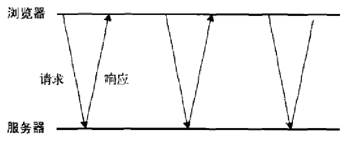
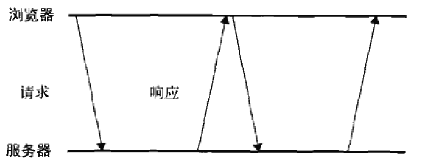

###Comet
`Comet`是`Alex Russell`发明的一个词,指的是一种更高级的`Ajax`技术(经常也有人称为`服务器推送`).`Ajax`是一种从页面向服务器请求数据的技术,而`Comet`则是一种服务器先页面推送数据的技术.`Comet`能够让信息近乎实时地被推送到页面,非常适合处理体育比赛的分数和股票报价

有两种实现`Comet`的方式: `长轮询`和`流`.长轮询是传统轮询(也被称为`短轮询`)的一个翻版.

短轮询: 浏览器定时向服务器发送请求,看有没有更新的数据.下图为短轮询的时间线



长轮询把短轮询颠倒一下.页面发起一个到服务器的请求,然后服务器一直保持连接打开,直到有数据可发送.发送完数据之后,浏览器关闭连接,随即又发起一个到服务器的新请求.这一过程在页面打开期间一直持续不断.下图为长轮询的时间线



第二种流行的`Comet`实现是`HTTP`流.流不同于上述两种轮询,因为它在页面的整个生命周期内只使用一个`HTTP`连接.具体说,就是浏览器向服务器发送一个请求,而服务器保持连接打开,然后周期性地向浏览器发送数据.

在`Firefox`,`Safari`,`Opera`,`Chrome`中,通过侦听`readystatechange`事件及检测`readyState`的值是否为3,就可以利用`XHR`对象实现`HTTP`流.在上述这些浏览器中,随着不断从服务器接收数据,`readyState`的值会周期性变为3.当`readyState`变为3时,`responseText`属性中就会保存接收到的所有数据.此时,就需要比较此前接收到的数据,决定从什么位置开始取得最新的数据.

```javascript
function createStreamingClient(url, progress, finished) {

    var xhr = new XMLHttpRequest(),
        received = 0

    xhr.open("get", url, true)
    xhr.onreadystatechange = function() {
        var result

        if (xhr.readyState == 3) {

            //get only the new data and adjust counter
            result = xhr.responseText.substring(received)
            received += result.length

            //call the progress callback
            progress(result)

        } else if (xhr.readyState == 4) {
            finished(xhr.responseText)
        }
    };
    xhr.send(null)
    return xhr
}

var client = createStreamingClient("streaming.php", function(data) {
    alert("Received: " + data)
}, function(data) {
    alert("Done!")
})
```