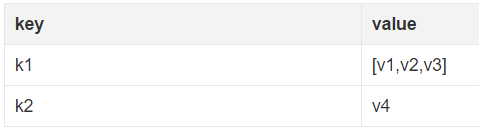

###FormData详解
转自[https://segmentfault.com/a/1190000006716454](https://segmentfault.com/a/1190000006716454)

####概述
FormData类型其实是在`XMLHttpRequest2`级定义的,它是为序列化表单以及创建与表单格式相同的数据（当然是用于XHR传输）提供便利.

####创建实例
创建一个formData对象实例有几种方式:

- 创建一个空对象实例

`var formData = new FormData()`

此时可以调用`append()`方法来添加数据

- 使用已有的表单来初始化一个对象实例

假如现在页面已经有一个表单

```html
<form id="myForm" action="" method="post">
    <input type="text" name="name" value="yzd">名字
    <input type="password" name="psw" value="123321">密码
    <input type="submit" value="提交">
</form>
```

我们可以使用这个表单元素作为初始化参数,来实例化一个formData对象

```javascript
// 获取页面已有的一个form表单
var form = document.getElementById("myForm")
// 用表单来初始化
var formData = new FormData(form)
// 我们可以根据name来访问表单中的字段
var name = formData.get("name") // 获取名字
var psw = formData.get("psw") // 获取密码
// 当然也可以在此基础上,添加其他数据
formData.append("token","kshdfiwi3rh")

console.log(name) //yzd
console.log(psw) //123321
```

####操作方式
首先,我们要明确formData里面存储的数据形式,一对key/value组成一条数据,key是唯一的,一个key可能对应多个value.如果是使用表单初始化,每一个表单字段对应一条数据,它们的HTML name属性即为key值,它们value属性对应value值.



#####获取值
我们可以通过get(key)/getAll(key)来获取对应的value

```javascript
formData.get(key) // 获取key为name的第一个值
formData.getAll(key) // 返回一个数组,获取key为name的所有值
```

#####添加数据
我们可以通过append(key, value)来添加数据,如果指定的key不存在则会新增一条数据,如果key存在,则添加到数据的末尾(**_注意如果key存在,则不是覆盖原来的value,而是再加上新的value,不管前后value值是否相同_**)

```javascript
formData.append("k1", "v1")
formData.append("k1", "v2")
formData.append("k1", "v1")

formData.get("k1") // "v1"
formData.getAll("k1") // ["v1","v2","v1"]
```

`append()`还可以接收第三个参数,当使用append() 方法的时候,可能会使用到第三个参数去发送文件名称（通过Content-Disposition头发送到服务器）.如果没有指定第三个参数或这个参数不被支持的话,第三个参数默认是”blob”

```javascript
var fileInput = document.querySelector('input[type="file"]')
var files = fileInput.files
var formData = new FormData()

for(var i = 0; i < files.length; i++) {
    var file = files[i]
    formData.append('files[]', file, file.name)
}
```

#####修改数据
我们可以通过set(key, value)来设置修改数据,如果指定的key不存在则会新增一条,如果存在,则会修改对应的value值(**_不管原先有几条value值,都会被覆盖掉_**)

```javascript
formData.append("k1", "v1")
formData.set("k1", "1")
formData.getAll("k1") // ["1"]
```

#####判断是否有该数据
可以通过has(key)来判断是否有对应的key值

```javascript
formData.append("k1", "v1")
formData.append("k2",null)

formData.has("k1") // true
formData.has("k2") // true
formData.has("k3") // false
```

#####删除数据
通过delete(key),来删除数据

```javascript
formData.append("k1", "v1")
formData.append("k1", "v2")
formData.append("k1", "v1")
formData.delete("k1")

formData.getAll("k1") // []
```

#####遍历
我们可以通过entries()来获取一个迭代器,然后遍历所有的数据,

```javascript
formData.append("k1", "v1")
formData.append("k1", "v2")
formData.append("k2", "v1")

var i = formData.entries()

console.log(i.next()) //{done:false, value:["k1", "v1"]}
console.log(i.next()) //{done:fase, value:["k1", "v2"]}
console.log(i.next()) //{done:fase, value:["k2", "v1"]}
console.log(i.next()) //{done:true, value:undefined}
```

可以看到返回迭代器的规则

- 每调用一次next()返回一条数据,数据的顺序由添加的顺序决定
- 返回的是一个对象,当其done属性为true时,说明已经遍历完所有的数据,这个也可以作为判断的依据
- 返回的对象的value属性以数组形式存储了一对key/value,数组下标0为key,下标1为value,如果一个key值对应多个value,会变成多对key/value返回

我们也可以通过values()方法只获取value值

```javascript
formData.append("k1", "v1")
formData.append("k1", "v2")
formData.append("k2", "v1")

for (var value of formData.values()) { //这里必须用of,不能用in来替代
    console.log(value)
}
```

