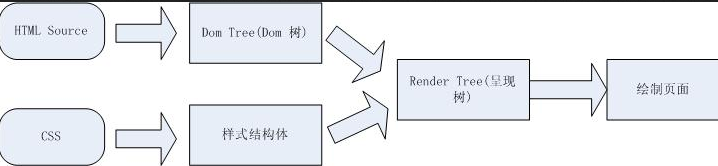

#页面的重绘和回流
转载自[http://blog.csdn.net/oscar999/article/details/38379523](http://blog.csdn.net/oscar999/article/details/38379523)

####页面呈现流程
在介绍重绘和回流之前,先看一下HTML 页面呈现的流程

1. 浏览器把获取到的html代码解析成1个Dom树.根节点就是document 对象,这里包含了所有的html tag,包括display:none隐藏,还有用JS动态添加的元素等

2. 浏览器把所有样式(主要包括css和浏览器的样式设置)解析成样式结构体,在解析的过程中会去掉浏览器不能识别的样式,比如IE会去掉-moz开头的样式,而firefox会去掉_开头的样式

3. dom tree和样式结构体结合后构建呈现树(render tree),render tree有点类似于dom tree,但其实区别有很大,render tree能识别样式,render tree中每个node都有自己的style,而且render tree不包含隐藏的节点(比如display:none的节点,还有head节点),因为这些节点不会用于呈现,而且不会影响呈现的,所以就不会包含到render tree中.注意 visibility:hidden隐藏的元素还是会包含到render tree中的,因为visibility:hidden 会影响布局(layout),会占有空间.根据css2的标准,render tree中的每个节点都称为box,box所有属性:width,height,margin,padding,left,top,border等

4. 浏览器就可以根据render tree来绘制页面了

####什么是reflow 和 repaint?
#####什么是reflow?
reflow指的是计算页面布局.某个节点reflow时会重新计算节点的尺寸和位置,而且还有可能触发其子节点、祖先节点和页面上的其他节点reflow.在这之后再触发一次repaint.

当render tree中的一部分(或全部)因为元素的规模尺寸,布局,隐藏等改变而需要重新构建.这就称为回流,每个页面至少需要一次回流,就是在页面第一次加载的时候.

#####什么是repaint?
repiant或者redraw遍历所有的节点检测各节点的可见性、颜色、轮廓等可见的样式属性,然后根据检测的结果更新页面的响应部分.
当render tree中的一些元素需要更新属性,而这些属性只是影响元素的外观,风格,而不会影响布局的,比如background-color.则就叫称为重绘

**_从上面可以看出,回流必将引起重绘,而重绘不一定会引起回流_**

**_回流和重绘都是发生在`render tree`中的_**
