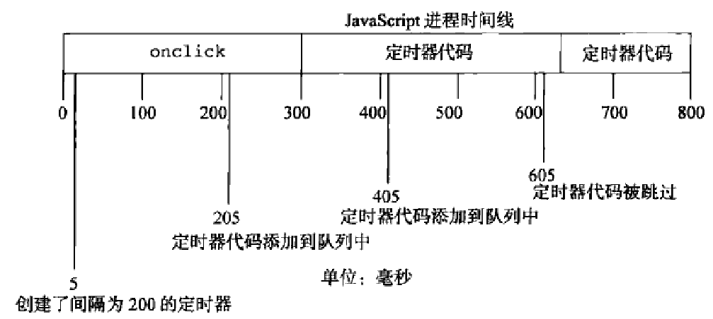

###重复的定时器
使用`setInterval()`创建的定时器确保了定时器代码规则地插入队列中.该方式的问题在于,定时器代码可能在代码再次被添加到队列之前还没有完成执行,结果导致定时器代码连续运行好几次,而之间没有任何停顿.

幸好JS引擎够聪明,能避免该问题.当使用`setInterval()`时,仅当没有该定时器的任何其他代码示例时,才将定时器代码添加到队列中.这确保了定时器代码加入到队列中的最小时间间隔为指定间隔.

但是JS引擎的以上行为又出现了两个问题: (1) 某些间隔会被跳过 (2) 多个定时器的代码执行之间的间隔可能会比预期的小.假设,某个`onclick`事件处理程序使用`setInterval()`设置了一个200ms间隔的重复定时器.如果事件处理程序花了300ms多一点的时间完成,同事定时器代码也花了差不多的时间,就会同事出现跳过间隔且连续运行定时器代码的情况.



该例子中的第一个定时器是在205ms处添加到队列中的,但是知道过了300ms处才能够执行.当执行该定时器代码时,在405ms处又给队列添加了另外一个副本.在一个间隔,即605ms处,第一个定时器代码仍然在运行,同时在队列中已经有了一个定时器代码的实例.那么结果就是在这个时间点上的定时器代码不会被添加到队列中.结果在5ms处添加的定时器代码结束之后,405ms处添加的定时器代码就立刻执行.

为避免以上两个缺点,可以使用`setTimeout`来代替`setInterval`.

```javascript
setTimeout(function(){
    //do something
    setTimeout(arguments.callee,interval)
},interval)
```

```html
<!doctype html>
<html>
<head>
    <title>Repeating Timers Example</title>
    <style>
        div{
            position: absolute;
            width: 100px;
            height: 100px;
            left: 0;
            top: 10px;
            background-color: red;
        }
    </style>
</head>
<body>
    <div id="myDiv"></div>

    <script type="text/javascript">
        setTimeout(function(){
        
           var div = document.getElementById("myDiv"),
               left = parseInt(div.style.left) + 5
               
           div.style.left = left + "px"
        
           if (left < 200){
               setTimeout(arguments.callee, 50)
           }
        
        }, 50)
    </script>
</body>
</html>
```