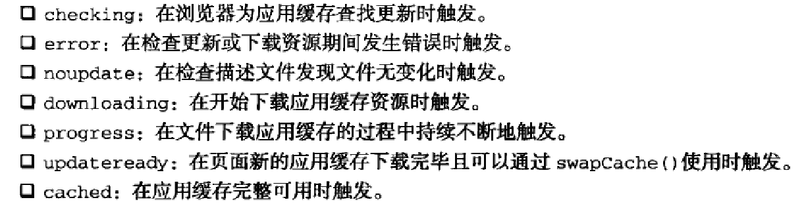

###应用缓存
主要内容看链接

[http://www.cnblogs.com/chyingp/archive/2012/12/01/explore_html5_cache.html](http://www.cnblogs.com/chyingp/archive/2012/12/01/explore_html5_cache.html)

以下为补充

应用缓存还有很多相关的事件:



如果更新离线缓存第三种方式(推荐写法)

```javascript
window.addEventListener('load', function(e) {
 
  window.applicationCache.addEventListener('updateready', function(e) {
    if (window.applicationCache.status == window.applicationCache.UPDATEREADY){
      // Browser downloaded a new app cache.
      // Swap it in and reload the page to get the new hotness.
      window.applicationCache.swapCache()
      if (confirm('A new version of this site is available. Load it?')) {
        window.location.reload()
      }
    } else {
      // Manifest didn't changed. Nothing new to server.
    }
  }, false)
 
}, false)
```

写在html上的:

```html
<!DOCTYPE HTML>
<html manifest="demo.appcache">
...
</html>
```

**_一个manifest文件可以是任何扩展文件类型,但必须有正确对应的mime-type_**

**_manifest属性可以指定一个绝对URL或是一个相对路径，但是，一个绝对URL需要和web app是同源的_**

####注意事项
1. 站点离线存储的容量限制是5M
2. 如果manifest文件，或者内部列举的某一个文件不能正常下载，整个更新过程将视为失败，浏览器继续全部使用老的缓存
3. 引用manifest的html必须与manifest文件同源，在同一个域下
4. 在manifest中使用的相对路径，相对参照物为manifest文件
5. CACHE MANIFEST字符串应在第一行，且必不可少
6. 系统会自动缓存引用清单文件的 HTML 文件
7. manifest文件中CACHE则与NETWORK，FALLBACK的位置顺序没有关系，如果是隐式声明需要在最前面
8. FALLBACK中的资源必须和manifest文件同源
9. 当一个资源被缓存后，该浏览器直接请求这个绝对路径也会访问缓存中的资源。
10. 站点中的其他页面即使没有设置manifest属性，请求的资源如果在缓存中也从缓存中访问
11. 当manifest文件发生改变时，资源请求本身也会触发更新