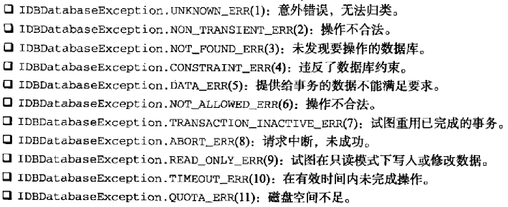
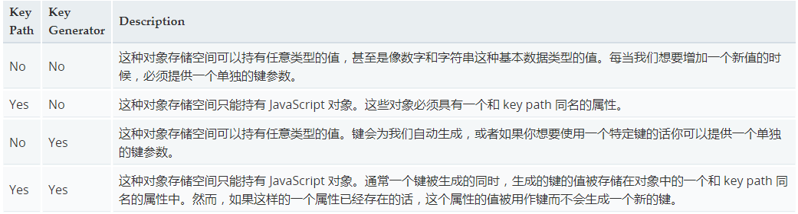

### IndexedDB
`Indexed Database API`,简称`IndexedDB`,是在浏览器中保存结构化数据的一种数据库.其思想是创建一套`API`,方便保存和读取JS对象,同时还支持查询及搜索

`IndexedDB`设计的操作`完全是异步进行`的.因此,大多数操作会以请求方式进行,但这些操作会在后期执行,然后如果成功则返回结果,如果失败则返回错误.差不多每一次`IndexedDB`操作,都需要开发人员注册`onerror`或`onsuccess`事件处理程序,以确保适当处理结果

在得到浏览器完整支持的情况下,`IndexedDB`将是一个作为`API`宿主的全局对象

#### 数据库
`IndexedDB`就是一个数据库,其最大的特色是使用对象保存数据,而不是使用表来保存数据.一个`IndexedDB`数据库,就是一组位于相同命名空间下的对象的集合

`IndexedDB`对象只有一个单一的方法: `open()`

`window.indexedDB.open('myDatabase')`

以上方法被调用的时候,就会打开一个名叫`myDatabase`的数据库,如果该数据库不存在,那么就被创建并打开,不管打开成功或者失败,都会返回一个`IDBRequest`对象,该对象上可以添加`onerror`和`onsuccess`事件处理程序

```javascript
var IDBRequest = window.indexedDB.open('myDatabase'),
    db

IDBRequest.onerror = function(event){
    console.log('发生错误,错误码为:' + event.target.errorCode)
}

IDBRequest.onsuccess = function(event){
    db = event.target.result
}
```

以上两个事件的`event.target`都是指向`IDBRequest`.

成功时候的`event.target.result`保存的是数据库实例对象(IDBDatabase).

错误时候的`event.target.errorCode`保存错误码,对应此次错误的原因



所有 IndexedDB 数据库都按照同样的 源(origin) 进行存储,比如mozilla.com 可能有一个名为 "binky" 的数据库,同时 mozilla.org 也可以有一个完全不同的名为 "binky" 的数据库

`open()`方法还可以有第二个参数版本号,数据库创建的时候默认版本号为 `1`,当我们传入的版本号和数据库当前版本号不一致时 `onupgradeneeded` 就会被调用,当然我们不能试图打开比当前数据库版本低的version,否则调用的就是 onerror 了

**_注意,版本号只能为整数,如果是小数,将四舍五入,不要小数_**

`onupgradeneeded` 被调用时,我们可以做一些建表/索引等操作(可以创建和删除对象存储空间以及构建和删除索引).

所以根据我的理解,添加版本号的作用在于可以操作数据库内容

```javascript
var IDBRequest = window.indexedDB.open('myDatabase'),
    db

IDBRequest.onerror = function(event){
    console.log('发生错误,错误码为:' + event.target.errorCode)
}

IDBRequest.onsuccess = function(event){
    db = event.target.result
}

IDBRequest.onupgradeneeded = function(event){
    var db = event.target.result
}
```

#### 对象存储空间
在建立了与数据库的连接之后,下一步就是使用对象存储空间.如果数据库的版本与你传入的版本不匹配,那可能就需要创建一个新的对象存储空间.

每当一条记录被存入对象存储空间,它就会和一个键相关联.我们可以使用每条记录中的某个指定字段作为键值（keyPath）,也可以使用自动生成的递增数字作为键值（keyGenerator）,也可以不指定.选择键的类型不同,objectStore 可以存储的数据结构也有差异



你也可以使用对象存储空间持有的对象,不是基本数据类型,在任何对象存储空间上创建索引.索引可以让你使用被存储的对象的属性的值来查找存储在对象存储空间的值,而不是用对象的键来查找.

此外,索引具有对存储的数据执行简单限制的能力.通过在创建索引时设置 unique 标记,索引可以确保不会有两个具有同样索引 key path 值的对象被储存.

因此,举例来说,如果你有一个用于持有一组 people 的对象存储空间,并且你想要确保不会有两个拥有同样 email 地址的 people,你可以使用一个带有 unique 标识的索引来确保这些

```javascript
// 我们的客户数据看起来像这样.
const customerData = [
    { ssn: "444-44-4444", name: "Bill", age: 35, email: "bill@company.com" },
    { ssn: "555-55-5555", name: "Donna", age: 32, email: "donna@home.org" }
]
const dbName = "the_name"

var request = indexedDB.open(dbName, 2)

request.onerror = function(event) {
  // 错误处理程序在这里.
}
request.onupgradeneeded = function(event) {
    var db = event.target.result

    // 创建一个对象存储空间来持有有关我们客户的信息.
    // 我们将使用 "ssn" 作为我们的 key path 因为它保证是唯一的.
    var objectStore = db.createObjectStore("customers", { keyPath: "ssn" })

    // 创建一个索引来通过 name 搜索客户.
    // 可能会有重复的,因此我们不能使用 unique 索引.
    objectStore.createIndex("name", "name", { unique: false })

    // 创建一个索引来通过 email 搜索客户.
    // 我们希望确保不会有两个客户使用相同的 email 地址,因此我们使用一个 unique 索引.
    objectStore.createIndex("email", "email", { unique: true })

    // 在新创建的对象存储空间中保存值
    for (var i in customerData) {
        objectStore.add(customerData[i])
    }
}
```

与`objectStore.add()`方法类似的是`objectStore.put()`方法.区别在于当空间中已经包含键值相同的对象时,`add()`方法会返回错误,而`put()`则会重写原有对象.简单说,可以把`add()`想象成插入新值,把`put()`想象成更新原有的值

还有很多很多[操作API](https://developer.mozilla.org/zh-CN/docs/Web/API/IDBObjectStore)

#### 事务
跨过创建对象存储空间之后,接下来所有操作都是通过事务来完成的.在数据库对象上调用`transaction()`方法可以创建事务.任何时候,只要想读取或修改数据,都要通过事务来组织所有操作:

`var transaction = db.transaction()`

如果要访问特定存储空间中的数据:

`var transaction = db.transaction('users')`

以上代码表示加载`users`存储空间中的数据,以便通过事务进行访问

如果要访问多个对象存储空间:

`var transaction = db.transaction(['users','anotherStore'])`

以上的这些事务的创建都是以只读的方式访问数据,而`transaction()`的第二个参数可以指定以何种方式来访问数据

- `'readonly'`: 只读,可并发执行
- `'readwrite'`: 可进行读写操作
- `'versionchange'`: 版本变更

`var transaction = db.transaction('users','readwrite')`

上述代码在取得事务的索引(`transaction`)后,使用`objectStore()`方法并传入存储空间的名称,就可以访问特定的存储空间了.然后可以像以前一样使用`add()`,`put()`,使用`get()`可以取得值,使用`delete()`可以删除对象,使用`clear()`可以删除所有对象

`var request = db.transaction('users','readwrite').objectStore('users').get('ssn')`

因为事务可以完成任何多个请求,所以事务对象本身也有事件处理程序: `onerror`和`oncomplete`

```javascript
transaction.onerror = function(event){
    //整个事务被取消了
}
```

```javascript
transaction.oncomplete = function(event){
    //整个事务都成功完成
}
```

#### 参考
[https://developer.mozilla.org/zh-CN/docs/Web/API/IndexedDB_API/Using_IndexedDB](https://developer.mozilla.org/zh-CN/docs/Web/API/IndexedDB_API/Using_IndexedDB)

[http://www.zhangxinxu.com/wordpress/2017/07/html5-indexeddb-js-example/](http://www.zhangxinxu.com/wordpress/2017/07/html5-indexeddb-js-example/)

[https://segmentfault.com/a/1190000002416903](https://segmentfault.com/a/1190000002416903)
