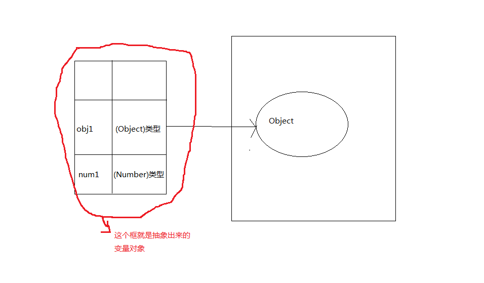
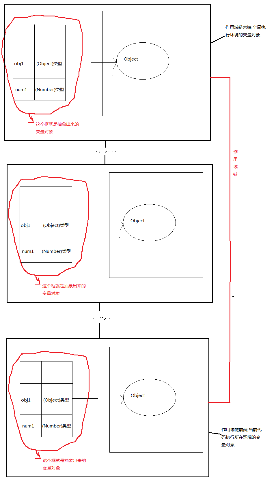
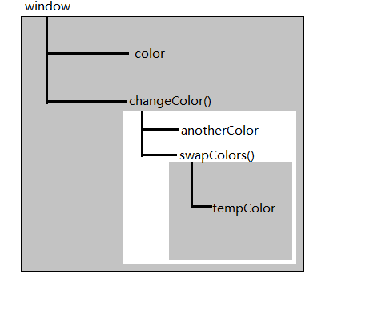

###执行环境
执行环境定义了变量或函数有权访问的其他数据,决定了它们各自的行为.全局执行环境是最外围的一个执行环境.根据ECMAScript实现所在的宿主环境不同,表示执行环境的对象也不同.在Web浏览器中,全局执行环境被认为是window对象,因此**所有全局变量和函数都是作为window对象的属性和方法创建的**

每个函数都有自己的执行环境.当执行流进入一个函数时,函数的环境就会被推入一个环境栈中.而在函数执行之后,栈将其环境弹出,把控制权返回给之前的执行环境.

某个执行环境中的所有代码执行完毕后,该环境被销毁,保存在其中的所有变量和函数定义也随之销毁(全局执行环境直到应用程序退出----例如关闭网页或浏览器时,才会被销毁)

###变量对象
每个执行环境都有一个与之关联的变量对象.



环境中定义的所有变量和函数都保存在这对象中,虽然我们编写的代码无法访问这个对象,但解析器在处理数据时会在后台使用它

###作用域链
当代码在一个环境中执行时,会创建变量对象的一个作用域链.作用域链前端始终是当前执行代码所在环境的变量对象.如果这个环境是函数,则将其活动对象作为变量对象.活动对象在最开始时只包含一个变量,即arguments对象(这个对象在全局环境中是不存在的)

以下是我所理解的作用域链图



标识符解析是沿着作用域链一级一级搜索标识符的过程.搜索过程始终从作用域链的前端开始,然后逐级向后回溯,直至找到标识符(如果找不到,通常为报错)

###作用域链具体示例
```javascript
var color = "blue";

function changeColor(){
    var anotherColor = "red";

    function swapColors(){
        var tempColor = anotherColor;
        anotherColor = color;
        color = tempColor;

        //这里可以访问tempColor/anotherColor/color
    }

    //这里可以访问anotherColor/color,但不能访问tempColor

}

//这里只能访问color
```

以上代码共涉及3个执行环境: 全局环境/changeColor()的局部环境和swapColors()的局部环境.



内部环境可以通过作用域链访问所有的外部环境,但外部环境不能访问内部环境中的任何变量和函数.每个环境都可以向上搜索作用域链,来查询变量和函数名.但任何环境都不能通过向下搜索作用域链而进入另一个执行环境.

###特别提醒
**_函数参数可以被当做当前函数环境内的局部变量_**