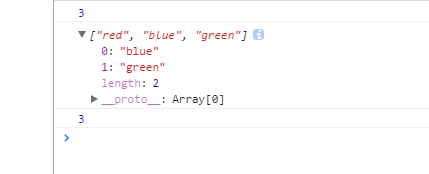
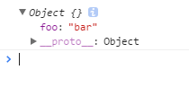

###在professional javascript队列时衍生的问题
####问题
```javascript
var colors = ['red','blue'];

var count = colors.push('green');
console.log(count);//3
console.log(colors);//red,blue,green
console.log(colors.length);//3

var item = colors.shift();
```

按照设想,应该是这样,但打印出来的图片如下:



疑问是控制台明明打印出来的是red,blue,green,但把数组展开,为什么只有0: blue 1: green length: 2 ? 但后面的数组长度却打印出3 这是什么问题?

####解答
这个问题在于浏览器中所实现的console.log的特性.

以前的时候,就有一个疑问,console.log是异步的吗？

```javascript
var obj = {};
console.log(obj);
obj.foo = 'bar';
```

打印如图:

;

在过去的有一段时间里,`webkit`浏览器的`console.log`是异步的,因此上面的代码会在控制台返回`{foo: bar}`.而如今的浏览器,比如最新的chrome,上面的代码只会看到一个空的`Object{}`,但点击查看详情（展开）的话,又会看到`{foo:bar}`,这是因为,`console.log`在代码执行的时候是立即拍摄了一个对象快照,但留在控制台的链接,却是一个指向对象的引用,因此如果点击了链接,将返回该引用对象的最新状态