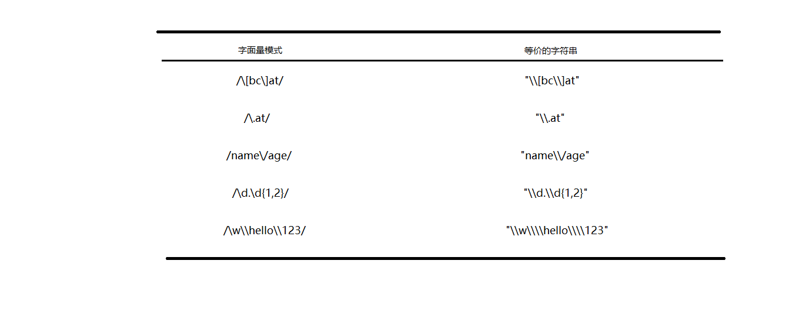

###正则表达式组成
`var expression = / pattern / flags;`

- 模式(pattern)部分是任何简单或复杂的正则表达式,可以包含字符类/限定符/分组/向前查找/反向引用
- 标志(flags),用以标明正则表达式的行为
    + g: 表示全局(global)模式,即模式将被应用于所有字符串,而非在发现第一个匹配项时立即停止
    + i: 表示不区分大小写(case-insensitive)模式,即在确定匹配项时,忽略模式与字符串的大小写
    + m: 表示多行(multiline)模式,即在到达一行文本末尾时还会继续查找下一行中是否存在在与模式匹配的项,在一个字符串是多行的时候,哪怕写了flag是g,也只匹配第一个,所以,需要加上m

**因此一个正则表达式就是模式和标志的组合**

```javascript

//匹配字符长中所有"at"的实例
var pattern1 = /at/g;

//匹配第一个"bat"或"cat",不区分大小写
var pattern2 = /[bc]at/i;

//匹配所有以"at"结尾的3个字符串的组合,不区分大小写
var pattern3 = /.at/gi;

```

模式中使用的所有**_元字符_**都必须转义,正则表达式中的元字符包括:
`(`,`)`,`[`,`]`,`{`,`}`,`*`,`+`,`\`,`|`,`^`,`$`,`?`,`.`

- 用`[]`构建一个简单的类

```javascript
var text = 'a1b2c3d4';
var re = /[abc]/gi; //中括号表示类,这里是a或者b或者c
var textNew = text.replace(re,'X');
console.log(textNew); //X1X2X3d4
```

- 类取反

```javascript
var text = 'a1b2c3d4';
var re = /[^abc]/g;//在中括号中加一个尖角,表示选中除了abc中的其他所有
var textNew = text.replace(re,'X');
console.log( textNew );//aXbXcXXX
```

- 范围类

```javascript
var text1 = 'a1b2t8u3z7F8P9Q20';
var re1 = /[a-z]/g; //这里表示a或者b或者...z
var textNew1 = text.replace(re,'!');
console.log( textNew1 );//!1!2!8!3!7!8!9!20

var text2 = '2016-10-31';
var re2 = /[0-9-]/g; //在范围里面-表示范围 在范围外面-还是表示自身
var textNew2 = text2.replace(re2,"?");
console.log( textNew2 );//??????????
```

- 预定义类


比如匹配一个 ab + 数字字符 + 任意字符的字符串: `/ab\d./`

- 边界类


```javascript
var text = "He is a boy.she is a girl.isn't it?";
var re = /\bis\b/g; //表示只匹配is 而且是前后都是有空格的那种
var textNew = text.replace(re,'&');
console.log( textNew );//
```

```javascript
var text = '@abc@12@';
var re = /^(@.)(.@)$/g; //在不是中括号里最前面,尖角表示以...开始
var textNew = text.replace(re,'?');
console.log( textNew );//?bc@12@
```

- 量词


- 贪婪模式

```javascript
var text = '123456789';
var re = /\d{2,4}/; //这里表示匹配数字2到4个长度,那么到底是2还是3还是4呢?
//在普通情况下,默认是4个长度

var textNew = text.replace(re,'?');
console.log( textNew );//?56789
```

- 非贪婪模式

```javascript
var text = '123456789';
var re = /\d{3,5}?/g;//在量词后面写上?,形成与贪婪模式相反的非贪婪模式,就是以最少长度去匹配
var textNew = text.match(re);
console.log( textNew );//["123", "456", "789"]
```

- 分组

```javascript
var text = 'a1b2c3d4';
var reNo = /[a-z]\d{3}/g;//如果是这样,表示查找a到z任意一个字母,且后面跟着3个数字,例如'd147',单我们需要的是'a1b2c3',所以要分组,如以下写法

var reYes = /([a-z]\d){3}/;
var textNew = text.replace(reYes,'?');
console.log( textNew );//?d4
```

- 或

```javascript
var text = 'ByronsperByrCasper';
var re = /Byr(on|Ca)/g; //可以是Byron也可以是ByrCa
var textNew = text.replace(re,'?');
console.log( textNew );//?sper?sper
```

- 反向引用

```javascript
var text = '2016-10-31'; //现在要把其变成10/31/2016 使用捕获组
var re = /^(\d{4})-(\d{2})-(\d{2})/g;
var textNew = text.replace(re,'$2/$3/$1');
console.log( textNew ); //10/31/2016
```

- 忽略分组:在()里面加上?:


这些元字符在正则表达式中都有一个或多个特殊用途,因此如果想要匹配字符串中包含的这些字符,就必须对它们进行转义

```javascript

//匹配第一个"bat"或"cat",不区分大小写
var pattern1 = /[bc]at/i;

//匹配第一个"[bc]at",不区分大小写
var pattern2 = /\[bc\]at/i;

//匹配所有以"at"结尾的3个字符的组合,不区分大小写
var pattern3 = /.at/gi;

//匹配所有".at",不区分大小写
var pattern4 = /\.at/gi;

```

以上皆为字面量形式来定义的正则表达式,以下为用RegExp构造函数来创建正则表达式

`var expression = new RegExp("pattern","flags")`;

**_注意这里的模式和标志都是字符串形式_**

```javascript

//匹配第一个"bat"或"cat",不区分大小写
var pattern1 = /[bc]at/i;

//匹配第一个"bat"或"cat",不区分大小写
var pattern2 = new RegExp("[bc]at","i");

```

由于RegExp构造函数的模式参数是字符串,所以在某些情况下要对字符进行双重转义.所有的元字符都必须双重转义,那些已经转义过的字符也是如此.凡是有转义字符的,字符串模式都是字面量模式的转义字符乘以2,如下图:



###RegExp实例属性: source/lastIndex

- `source`返回的是以字面量形式表示的字符串

```javascript

var pattern1 = /\[bc\]at/i;
console.log( pattern1.source ); //\[bc\]at

var pattern2 = new RegExp("\\[bc\\]at","i");
console.log( pattern2.source ); //\[bc\]at
console.log( typeof pattern2.source ); //string
```
 
- `lastIndex`: 整数,表示开始搜索下一个匹配项的字符位置,从0算起.具体见---RegExpInstance.md


###辅助工具
[https://regexper.com/](https://regexper.com/)
