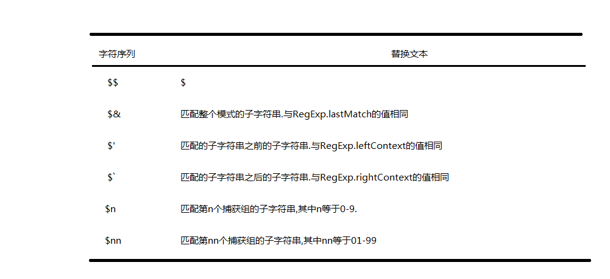

###str.search()
- 用于检索字符串中指定的子字符串,或检索与正则表达式相匹配的子字符串
- 方法返回第一个匹配结果index,找不到返回-1
- str.search()方法不执行全局匹配,无论正则标识中是否有global标识,都会忽略

```javascript
var str = 'a1b2d3t8z1';
var re = /1/g;
console.log( str.search('1') );//1
console.log( str.search(re) );//1 不会全局搜索
console.log( str.search('!') );//-1 找不到返回-1
console.log( str.search(1) );//1 search会模拟正则,这里的1被转为/1/,所以有效
```

###str.match()
- 正则无全局情况下
    + 没有找到相匹配的字符串,返回null
    + 找到了则返回数组,并将有关信息存于数组中
        * 返回数组的第一个索引下是匹配到的文本,其余索引下是各个捕获组中的东西
        * 返回数组的一个index属性,表示匹配字符串的起始位置
        * 返回数组的一个input属性,表示原字符串本身

```javascript
var text1 = 'a1b2c3';
var re1 = /z/;
var arrText1 = text1.match(re1);
console.log( arrText1 );//null

var text2 = '1a2b3c4d5e6f';
var re2 = /\d(\w)\d/;
var arrText2 = text2.match(re2);
console.log( arrText2 );//['1a2','a']
console.log( arrText2.index );//0
console.log( arrText2.input );//1a2b3c4d5e6f
```

- 正则在全局调用下
    + 没有找到相匹配的字符串,返回null
    + 找到则返回数组,没有index和input属性,也没有捕获组

```javascript
var str = '1a2b3c4d5e6f',
    reg = /\d\w\d/g;
console.log(str.match(reg)); //["1a2", "3c4", "5e6"]
//这里为什么没有2b3,4d5?
//因为在 js 正则表达式中，全局匹配，被匹配过的内容，将不再参与下次匹配，这个由 lastIndex 来控制
var str = '1a2b3c4d5e6f',
  reg = /\d\w\d/g;
var a;
while(a = reg.exec(str)){
  console.log(a[0])
  reg.lastIndex -= 1; //也就是说lastIndex是可读可写的,可以通过lastIndex来操控正则匹配的起始位置
}
```

###str.split()
```javascript
var text1 = 'a,b,c,d';
var arr1 = text1.split(',');//其实这里就是模拟/,/
console.log( arr1 );//["a", "b", "c", "d"]

var text2 = 'a1b2c3d4';
var arr2 = text2.split(/\d/);
console.log( arr2 );//["a", "b", "c", "d", ""]

var colorText = "red,blue,green,yellow";
var colors1 = colorText.split(",");      //["red", "blue", "green", "yellow"]
var colors2 = colorText.split(",", 2);   //["red", "blue"]
var colors3 = colorText.split(/[^\,]+/); //["", ",", ",", ",", ""]
//上一行,以逗号以外的其他作为分隔符
```

###str.replace(x1,x2)
- x1可以是字符串,也可以是正则
- x2可以是要替换的字符串,也可以是函数
    + 函数相当于回调,拥有四个参数
        * 参数一: 匹配字符串
        * 参数二: 正则表达式捕获组内容,没有分组就没有该参数
        * 参数三: 匹配项在字符串中的index
        * 参数四: 原字符串

如果第二个参数是字符串,还可以使用一些特殊的字符序列,将正则表达式操作得到的值插入到结果字符串中



```javascript
var text = "cat, bat, sat, fat";
var result = text.replace(/(.at)/g, "word ($1)");
alert(result);    //word (cat), word (bat), word (sat), word (fat)

var text = 'dd!ff';
var str = text.replace(/!/,"@($`)");
console.log(str); //dd@(dd)ff

var text = 'dd!ff';
var str = text.replace(/!/,"@($')");
console.log(str); //dd@(ff)ff

var text = 'dd!ff';
var str = text.replace(/!/,"@($&)");
console.log(str); //dd@(!)ff

var text = 'dd!ff';
var str = text.replace(/!/,"@($$)");
console.log(str); //dd@($)ff
```

```javascript
var str1 = 'a1b2c3d4e5'.replace(/\d/g,function(match,index,origin){
    console.log(index);
    return parseInt(match) + 1;
})
console.log(str1);//a2b3c4d5e6

var str2 = 'a1b2c3d4e5'.replace(/(\d)(\w)(\d)/g,function(match,group1,group2,group3,index,origin){
    console.log(match);
    console.log(typeof group1);//string
    return parseInt(group1) + parseInt(group3);
})
console.log(str2);//a3c7e5
```
