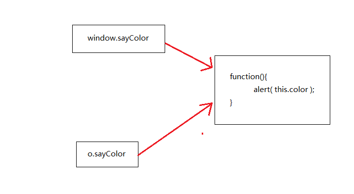

###arguments/this
函数内部有两个特殊的`对象`: arguments/this.其中arguments是一个类数组对象,包含传入函数中的所有参数.arguments对象还有一个`callee`属性,该属性是一个`指针`,指向拥有这个arguments对象的函数

####递归
```javascript

//阶乘函数

function factorial(num){
    if( num <= 1 ){
        num = 1;
    }else{
        return num * factorial( num - 1 );
    }
}

//在函数体内有函数名,这导致函数体内代码与函数名拥有紧密耦合度,如果函数名更改,那么函数体内代码也要更改,否则不能顺利执行函数

//优化

function newFactorial(num){
    if( num <= 1 ){
        num = 1;
    }else{
        return num * arguments.callee( num - 1 );
    }
}

```

但是在严格模式下,不能使用`arguments.callee`,可用命名函数表达式解决
```javascript
var factorial = (function f(num){
    if( num<=1 ){
        return 1;
    }else{
        return num * f( num-1 );
    }
})
```

- this

this引用的是函数执行的`环境对象`---或者也可以说是this值(当在全局作用域下调用函数时,this对象引用的就是window)

```javascript

window.color = 'red';
var o = { color: 'blue' };

function sayColor(){
    alert( this.color );
}

sayColor(); //red

o.sayColor = sayColor;
o.sayColor(); //blue

//this指向的就是函数执行的环境对象

```



函数的名字仅仅是一个包含指针的变量,即使是在不同的环境中执行,全局sayColor函数与o.sayColor指向的仍然是同一个函数,但环境不同,this不同

[http://www.ruanyifeng.com/blog/2010/04/using_this_keyword_in_javascript.html](http://www.ruanyifeng.com/blog/2010/04/using_this_keyword_in_javascript.html)

- functionName.caller

该属性中保存着调用当前函数的函数的引用,如果是全局作用域中调用当前函数,值为null

应用场景: 主要用于查看函数本身被哪个函数调用

```javascript

function outer(){
    inner();
}

function inner(){
    alert(inner.caller);
    alert(this);
}

outer();
/*
function outer(){
    inner();
}
*/

```


