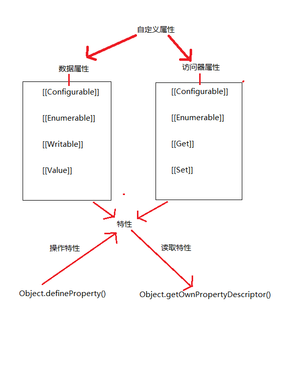

####对象定义
ECMA-262: "无序属性的集合,其属性可以包含基本值、对象和函数".可以把ECMAScript的对象想象成散列表: 无非就是一组名值对,其中值可以是基本值,对象和函数

####创建对象及属性

```javascript
var person = new Object();
person.name = 'yzd';
person.age = 99;
person.job = 'Software Engineer';

person.sayName = function(){
    alert( this.name );
}
```

```javascript
var person = {
    name: 'yzd',
    age: 99,
    job: 'Software Engineer',
    sayName: function(){
        alert(this.name);
    }
}
```

ECMAScript中有两种属性: 数据属性和访问器属性.这些属性在创建时都带有一些特征值,javascript通过这些特征值来定义它们的行为.



####数据属性
数据属性包含一个数据值的位置.在这个位置可以读取和写入值.

- [[Configurable]]: 表示能否通过delete删除属性从而重新定义属性,能否修改属性的特性,或者能否把属性修改为访问器属性.对于直接在对象上定义的属性,默认为true
- [[Enumerable]]: 表示能否通过for-in循环返回属性.对于直接在对象上定义的属性,默认为true
- [[Writable]]: 表示能否修改属性的值.对于直接在对象上定义的属性,默认为true
- [[Value]]: 包含这个属性的数据值.读取属性值的时候,从这个位置读;写入属性值的时候,把新值保存在这个位置.

**_注意在实际操作的时候,这四个特性开头不用大写否则无效_**

上述创建的person对象里面的属性,除了[[Value]],其他特性都是默认为true;而创建的新的属性还没赋予值的时候,[[Value]]默认为undefined

要修改属性默认的特性,必须使用ECMAScript5的Object.defineProperty()方法,该方法接收3个参数: 属性所在的对象,属性的名字和一个描述符对象.描述符对象的属性必须是以上4个特性中的一个或者多个

```javascript
var person = {};
Object.defineProperty(person,'name',{
    writable: false,
    value: 'yzd'
})
console.log( person.name ); //yzd
person.name = 'aaa';  //不能修改,在严格模式下报错
console.log( person.name ); //yzd
```

```javascript
var person = {};
Object.defineProperty(person,'name',{
    configurable: false,
    value: 'yzd'
})
console.log( person.name ); //yzd
delete person.name  //不能删除,在严格模式下报错
console.log( person.name ); //yzd
```

一旦把属性定义为不可配置的,就不能再把它变回可配置了.此时,再调用Object.defineProperty()方法修改除writable之外的特性,都会导致错误

```javascript
var person = {};
Object.defineProperty(person,'name',{
    configurable: false,
    value: 'yzd'
})

Object.defineProperty(person,'name',{
    configurable: true,
    value: 'yzd'
})

//报错: Cannot redefine property: name(…)
```

在调用Object.defineProperty()方法时,如果不指定,configurable/writable/enumerable都是默认false的

####访问器属性
访问器属性不包含数据值,它们包含一对getter和setter函数(这两个函数不是必需的).在读取访问器属性时,会调用getter函数,这个函数负责返回有效的值;在写入访问器属性时,会调用setter函数并传入新值,该函数负责决定如何处理数据

- [[Configurable]]: 表示能否通过delete删除属性从而重新定义属性,能否修改属性的特性,或者能否把属性修改为数据属性.对于直接在对象上定义的属性,默认为true
- [[Enumerable]]: 表示能否通过for-in循环返回属性.对于直接在对象上定义的属性,默认为true
- [[Get]]: 在读取属性时调用的函数.默认为undefined
- [[Set]]: 在写入属性时调用的函数.默认为undefined

访问器属性不能直接定义,必须使用Object.defineProperty()来定义,所以只有getter不能写入,只有setter不能读取

```javascript
var book = {
    _year: 2004, //前面加下划线表示为访问器属性
    edition: 1
};
  
Object.defineProperty(book, "year", {
    get: function(){ //2.把修改后的属性重新写入
        return this._year;
    },
    set: function(newValue){ //1.用属性year来修改属性_year和edition
    
        if (newValue > 2004) {
            this._year = newValue;
            this.edition += newValue - 2004;
        
        }
    }
});

book.year = 2005;
alert(book.edition);   //2
```

####定义多个属性
```javascript
var book = {};

Object.defineProperties(book, {
    _year: {
        value: 2004
    },
    
    edition: {
        value: 1
    },
    
    year: {            
        get: function(){
            return this._year;
        },
        
        set: function(newValue){
            if (newValue > 2004) {
                this._year = newValue;
                this.edition += newValue - 2004;
            }                  
        }            
    }        
});
   
book.year = 2005;
alert(book.edition);   //2

//这里定义了两个数据属性(_year和edition)和一个访问器属性(year)
```

####读取属性特性
Object.getOwnPropertyDescriptor(),可以取得给定属性的描述符.接收两个参数:属性所在对象和要读取其描述符的属性.

```javascript
var book = {};

Object.defineProperties(book, {
    _year: {
        value: 2004
    },
    
    edition: {
        value: 1
    },
    
    year: {            
        get: function(){
            return this._year;
        },
        
        set: function(newValue){
            if (newValue > 2004) {
                this._year = newValue;
                this.edition += newValue - 2004;
            }                  
        }            
    }        
});
   
var descriptor = Object.getOwnPropertyDescriptor(book, "_year");
alert(descriptor.value);          //2004
alert(descriptor.configurable);   //false
alert(typeof descriptor.get);     //"undefined"

var descriptor = Object.getOwnPropertyDescriptor(book, "year");
alert(descriptor.value);          //undefined
alert(descriptor.enumerable);     //false
alert(typeof descriptor.get);     //"function"
```
