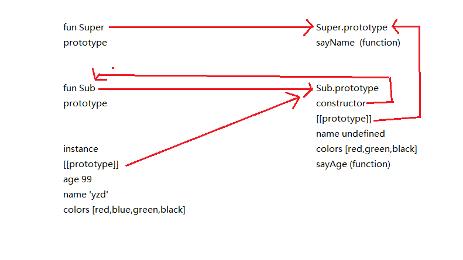

组合继承也叫作伪经典继承,指的是将原型链和借用构造函数的技术组合在一起.

基本思路: 使用原型链实现对原型属性和方法的继承,通过借用构造函数来实现对实例属性的继承

```javascript
function SuperType(name){
    this.name = name;
    this.colors = ['red','blue','green'];
}

SuperType.prototype.sayName = function(){
    alert( this.name );
}

function SubType(name,age){
    SuperType.call(this,name);

    this.age = age;
}

SubType.prototype = new SuperType(); //第一次调用超类型构造函数
SubType.prototype.constructor = SubType;
SubType.prototype.sayAge = function(){
    alert( this.age )
}

var instance1 = new SubType('yzd',99); //第二次调用超类型构造函数
instance1.colors.push('black');
alert(instance1.colors);  //"red,blue,green,black"
instance1.sayName();      //"yzd";
instance1.sayAge();       //99


var instance2 = new SubType("Greg", 27);
alert(instance2.colors);  //"red,blue,green"
instance2.sayName();      //"Greg";
instance2.sayAge();       //27
```



避免了原型链和借用构造函数的缺陷,成为JavaScript中最常用的继承模式.而且,instanceof和isPrototypeOf()也能够识别基于组合继承创建的对象

组合继承最大的问题就是无论在什么时候,都会调用两次超类型构造函数;并且无法避免在子类型原型上创建多余的属性,如上述例子的`name`,`colors`