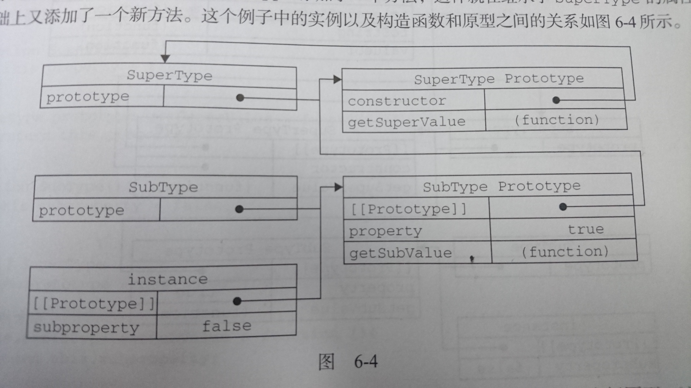
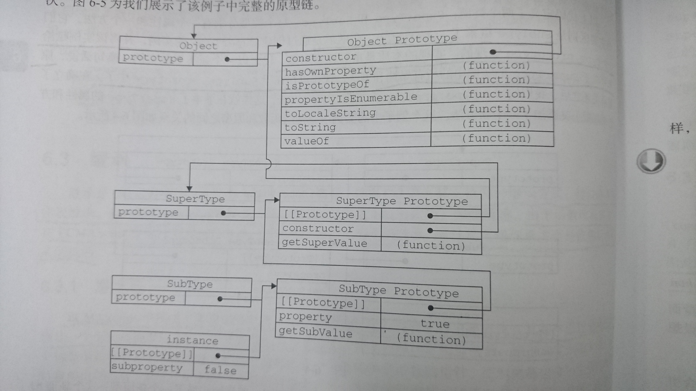
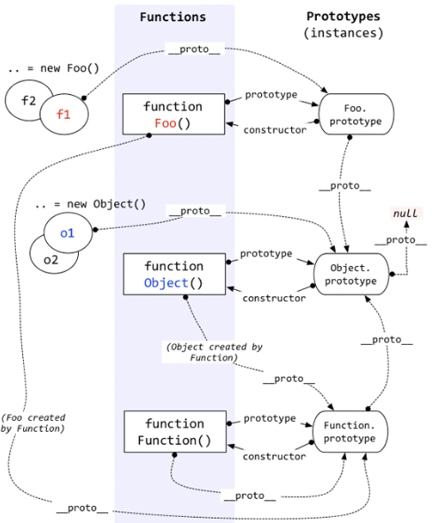

###继承
许多oo语言都支持两种继承方式: 接口继承和实现继承.接口继承只继承方法签名,而实现继承则继承实际的方法.因为js函数没有签名,在ECMAScript中无法实现接口继承.ECMAScript只支持实现继承,而实现继承主要是依靠原型链来实现的

####原型链
基本思路: 利用原型让一个引用类型继承另一个引用类型的属性和方法
```javascript
function SuperType(){
    this.property = true;
}

SuperType.prototype.getSuperValue = function(){
    return this.property;
};

function SubType(){
    this.subproperty = false;
    // this.property = false;
}

//inherit from SuperType
SubType.prototype = new SuperType();

//注意 这里要先重写SubType.prototype,然后再添加方法

SubType.prototype.getSubValue = function (){
    return this.subproperty;
};

var instance = new SubType();
alert(instance.getSuperValue());   //true

alert(instance instanceof Object);      //true
alert(instance instanceof SuperType);   //true
alert(instance instanceof SubType);     //true

alert(Object.prototype.isPrototypeOf(instance));    //true
alert(SuperType.prototype.isPrototypeOf(instance)); //true
alert(SubType.prototype.isPrototypeOf(instance));   //true
```



这里实现继承的关键就是重写了`SubType.prototype`,使其成为了`SuperType`的实例.这样重写的新原型不仅具有作为一个`SuperType`的实例所拥有的全部属性和方法,而且其内部还有一个指针,指向`SuperType`的原型

调用instance.getSuperValue()会经历三个搜索步骤:

1. 搜索实例
2. 搜索`SubType.prototype`
3. 搜索`SuperType.prototype`

####完整的原型链


所有引用类型默认都继承了Object,而这个继承也是通过原型链实现的.所有函数的默认原型都是Object的实例,因此默认原型都会包含一个内部指针,指向Object.prototype.这也正是所有自定义类型都会继承toString()/valueOf()等默认方法的根本原因



####谨慎定义方法
```javascript
function SuperType(){   //被继承的函数叫做超类型(父类，基类)
    this.property = true;
}

SuperType.prototype.getSuperValue = function(){
    return this.property;
};

function SubType(){  //继承的函数叫做子类型(子类，派生类)
    this.subproperty = false;
}

//inherit from SuperType
SubType.prototype = new SuperType();

//new method 添加新方法
SubType.prototype.getSubValue = function (){
    return this.subproperty;
};

//override existing method  重写超类型中的方法
SubType.prototype.getSuperValue = function (){
    return false;
};

var instance = new SubType();
alert(instance.getSuperValue());   //false

var instance1 = new SuperType();
alert( instance1.getSuperValue() ); //true
```

####原型链的问题
- 一个原型成为了另一个构造函数的实例,从而继承了一个引用类型(如数组),那么会导致引用类型的共享

```javascript
function SuperType(){
    this.colors = ["red", "blue", "green"];
}

function SubType(){}

//inherit from SuperType
SubType.prototype = new SuperType();

var instance1 = new SubType();
instance1.colors.push("black");
alert(instance1.colors);    //"red,blue,green,black"

var instance2 = new SubType();
alert(instance2.colors);    //"red,blue,green,black"
```

- 在创建子类型的实例时,不能向超类型的构造函数中传递参数.没有办法在不影响所有对象实例的情况下,给超类型的构造函数传递参数