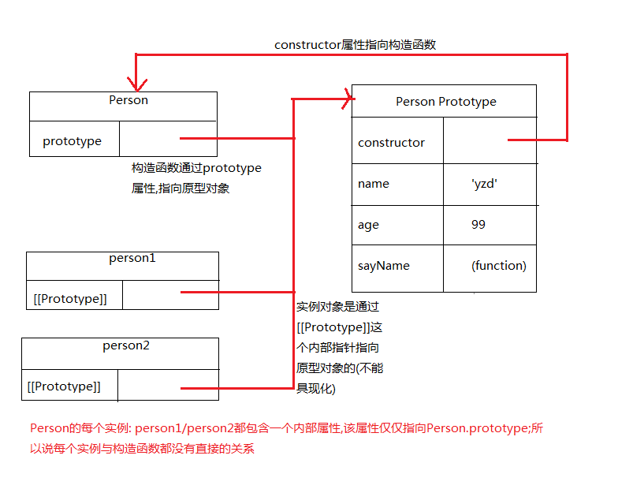

####原型模式
>每个函数都有一个prototype(原型)属性,这个属性是一个指针,指向一个对象,而这个对象的用途是包含可以由特定类型的所有实例共享的属性和方法

prototype属性也叫作原型属性,它是一个指针,指向一个对象.该对象是用来存放各种特殊对象实例(开发者自定义实例,内置对象等)需要共享的属性和方法

>prototype就是通过调用构造函数而创建的那个对象实例的原型对象

prototype指向的对象是各种特殊对象实例(开发者自定义实例,内置对象等)的原型对象

```javascript

function Person(){}

Person.prototype.name = 'yzd';
Person.prototype.age = 99;
Person.prototype.job = 'Software Engineer';
Person.prototype.sayName = function(){
    alert( this.name );
};

var person1 = new Person();
var person2 = new Person();

console.log( person1.name === person2.name ); //true
console.log( person1.sayName === person2.sayName ); //true
//person1和person2通过构造函数的原型实现了共享同样的属性和方法

```

####理解原型对象
任何一个新函数的创建,都会自动获得一个`prototype`属性,这个属性是一个指针,指向原型对象.而原型对象在默认情况下,都会自动获得一个`constructor`(构造函数)属性,也是一个指针,用来指向`prototype`属性所在的函数,即指向构造函数

当创建了一个自定义的构造函数后,其原型对象默认只会取得`constructor`属性;至于其他方法,则都是从Object继承而来的.

当调用构造函数创建一个新实例后,该实例的内部将包含一个指针(内部属性,类似于构造函数的原型属性,但不能具象化),指向构造函数的原型对象.ECMA-262第5版中管这个指针叫做`[[Prototype]]`.但在部分浏览器中,可以通过属性`__proto__`来具象化

**_注意:实例内部指向原型对象的指针是实例与构造函数的原型对象之间的链接,而不是存在于实例与构造函数之间的链接_**



person1和person2两个实例都不包含属性和方法,但可以调用person1/2.sayName().这是通过查找对象属性的过程来实现的

#####实例指向原型对象的具现化方式
- Firefox/Safari/Chrome/Edge都支持一个属性`__proto__`来实现实例指向原型对象的具现化(详见[proto.html](proto.html))
- ECMAScript5中的新方法: Object.getPrototypeOf()方法(详见[getPrototypeOf.html](getPrototypeOf.html))

#####确定实例对象和原型对象之间存在关系
`isPrototypeOf()`

```javascript
function Person(){}

Person.prototype.name = 'yzd';
Person.prototype.age = 99;
Person.prototype.job = 'Software Engineer';
Person.prototype.sayName = function(){
    alert( this.name );
};

var person1 = new Person();
var person2 = new Person();

console.log( Person.prototype.isPrototypeOf(person1) ); //true

console.log(Person.prototype.isPrototypeOf(person1) === Person.prototype.isPrototypeOf(person2)); //true

```

#####多个对象实例共享原型所保存的属性和方法的基本原理
每当代码读取某个对象的某个属性时,都会执行一次搜索,目标是具有给定名字的属性.搜索首先从对象实例本身开始.如果在实例中找到了具有给定名字的属性,则返回该属性的值;如果没有找到,则继续搜索指针指向的原型对象,在原型对象中查找具有给定名字的属性.如果在原型对象中找到了这个属性,则返回该属性的值

虽然可以通过对象实例访问保存在原型中的值,但却不能通过对象实例重写原型中的值.在实例中添加一个属性,而该属性与实例原型中的一个属性同名,则该属性将会屏蔽原型中的那个属性.换句话说,添加这个属性只会阻止我们访问原型中的同名属性,但不会修改同名属性.即使将实例属性设置为null,也只会在实例中设置这个属性,而不会恢复其指向原型的连接.不过使用delete操作符则可以完全删除实例属性,从而能重新访问原型中的属性

```javascript
function Person(){}

Person.prototype.name = "Nicholas";
Person.prototype.age = 29;
Person.prototype.job = "Software Engineer";
Person.prototype.sayName = function(){
    alert(this.name);
};

var person1 = new Person();
var person2 = new Person();

person1.name = "Greg";
alert(person1.name);   //"Greg" – from instance
alert(person2.name);   //"Nicholas" – from prototype

delete person1.name;
alert(person1.name);   //"Nicholas" - from the prototype
```

#####使用hasOwnProperty()检测是否是实例属性
```javascript
function Person(){}

Person.prototype.name = "Nicholas";
Person.prototype.age = 29;
Person.prototype.job = "Software Engineer";
Person.prototype.sayName = function(){
    alert(this.name);
};

var person1 = new Person();
var person2 = new Person();

person1.name = "Greg";

console.log( person1.hasOwnProperty('name') );//true
console.log( person2.hasOwnProperty('name') );//false
                            //注意 这里要写字符串
```

####原型与in操作符
- 单独使用in: in操作符会在 通过对象能够访问给定属性 时返回true,无论该属性存在于实例中还是原型中

```javascript
function Person(){}

Person.prototype.name = "Nicholas";
Person.prototype.age = 29;
Person.prototype.job = "Software Engineer";
Person.prototype.sayName = function(){
    alert(this.name);
};

var person1 = new Person();
var person2 = new Person();

console.log(person1.hasOwnProperty("name"));  //false
console.log("name" in person1);  //true

person1.name = "Greg";
console.log(person1.name);   //"Greg" – from instance
console.log(person1.hasOwnProperty("name"));  //true
console.log("name" in person1);  //true

delete person1.name;
console.log(person1.name);   //"Nicholas" - from the prototype
console.log(person1.hasOwnProperty("name"));  //false
console.log("name" in person1);  //true

console.log( "constructor" in person2 ); //true
```

- 使用for-in循环

返回的是所有能够通过对象访问的、可枚举的(enumerable)属性,其中既包括存在于实例中的属性,也包括存在于原型中的属性.屏蔽了原型中不可枚举属性(即将[[Enumerable]]标记为false的属性)的实例属性也会在for-in循环中返回,因为根据规定,所有开发者定义的属性都是可枚举的(详见[for-in.html](for-in.html))

要取得当前对象可枚举的属性,可以使用keys()方法,返回的是数组格式

```javascript
function Person(){}

Person.prototype.name = "Nicholas";
Person.prototype.age = 29;
Person.prototype.job = "Software Engineer";
Person.prototype.sayName = function(){
    alert(this.name);
};

var keys = Object.keys(Person.prototype);
console.log(keys);   //["name", "age", "job", "sayName"]

var p1 = new Person();
p1.name = 'yzd';
p1.age = 99;

console.log( Object.keys(p1) ); //["name", "age"]
```

如果想要得到所有实例属性,无论是否可枚举,都可以使用Object.getOwnPropertyNames()方法,返回的是数组格式

```javascript
function Person(){}

Person.prototype.name = "Nicholas";
Person.prototype.age = 29;
Person.prototype.job = "Software Engineer";
Person.prototype.sayName = function(){
    alert(this.name);
};

var keys = Object.getOwnPropertyNames(Person.prototype);
console.log(keys);   //["constructor,name,age,job,sayName"]
```

#####更简单的原型语法
```javascript
function Person(){}

Person.prototype = {
    name: 'yzd',
    age: 99,
    job: 'Front End Engineer',
    sayName: function(){
        alert( this.name );
    }
}

//这里重写了Person.prototype,所以要重新写constructor属性
Object.defineProperty(Person.prototype,'constructor',{
    value: Person,
    enumerable: false
})

//为什么要这么费事的写呢,因为上面已经提到开发者定义的属性都是可枚举的,而constructor本身是不可枚举的
```
