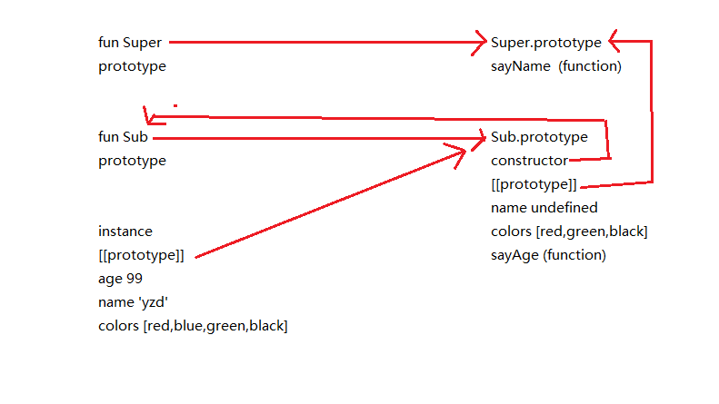

组合继承最大问题就是调用两次超类型构造函数,并且在子类型构造函数中创建了多余的属性.如下

```javascript
function SuperType(name){
    this.name = name;
    this.colors = ['red','blue','green'];
}

SuperType.prototype.sayName = function(){
    alert( this.name );
}

function SubType(name,age){
    SuperType.call(this,name);

    this.age = age;
}

SubType.prototype = new SuperType(); //第一次调用超类型构造函数
SubType.prototype.constructor = SubType;
SubType.prototype.sayAge = function(){
    alert( this.age )
}

var instance1 = new SubType('yzd',99); //第二次调用超类型构造函数
instance1.colors.push('black');
alert(instance1.colors);  //"red,blue,green,black"
instance1.sayName();      //"yzd";
instance1.sayAge();       //99
```



所谓寄生组合式继承,即通过借用构造函数来继承属性,通过原型链的混成形式来继承方法.其背后的基本思路: 不必为了指定子类型的原型而调用超类型的构造函数,我们所需要的无非是超类型原型的一个副本而已.本质上,就是使用寄生式继承来继承超类型的原型,然后再将结果指定给子类型的原型

```javascript
function inheritPrototype(subType,superType){
    var prototype = Object(superType.prototype);
    //Object传入对象,返回传入对象的引用
    //需要的无非是超类型原型的一个副本
    prototype.constructor = subType;
    subType.prototype = prototype;
}

function SuperType(name){
    this.name = name;
    this.colors = ["red","blue","green"];
}

SuperType.prototype.sayName = function(){
    alert(this.name);
}

function SubType(name,age){
    SuperType.call(this,name); //通过借用构造函数来继承属性
    this.age = age;
}

inheritPrototype(SubType,SuperType);

SubType.prototype.sayAge = function(){
    alert(this.age);
}

var instance = new SubType('yzd',99);
instance.sayAge();
```

这个例子的高效率体现在只调用一次超类型构造函数,并且避免了在子类型构造函数上创建不必要的,多余的属性.与此同时,原型链还能保持不变;因此,还能够正常使用instanceof和isPrototypeOf();开发人员普遍认为寄生组合式继承是引用类型最理想的继承范式