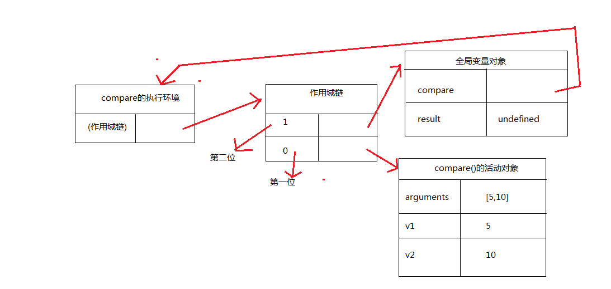
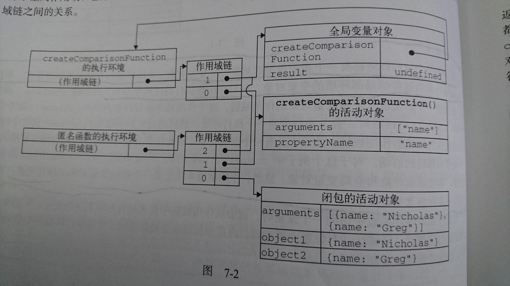

###闭包
闭包是指有权访问另一个函数作用域中的变量的函数.闭包是函数.常见的一种是在函数内部创建的函数

####如何创建作用域链以及作用域链有什么作用?
当某个函数被调用时,会创建一个执行环境以及相应的作用域链.然后,使用arguments和其他命名参数的值来初始化函数的活动对象.但在作用域链中,外部函数的活动对象始终处于第二位,外部函数的外部函数的活动对象处于第三位...直至作为作用域链终点的全局执行环境

```javascript
function compare(v1,v2){
    if( v1 < v2 ){
        return -1;
    }else if( v1 > v2 ){
        return 1;
    }else{
        return 0;
    }
}

var result = compare(5,10);
```

上述代码先定义了`compare()`函数,然后又在全局作用域中调用它.当调用`compare()`时,会创建一个包含`arguments/v/v2`的活动对象.全局执行环境的变量对象(包含`result`,`compare`)在`compare()`执行环境的作用域链中则处于第二位



后台的每个执行环境都有一个表示变量的对象---变量对象.全局环境的变量对象始终存在,而像`compare()`函数这样的局部环境的变量对象,则只在函数执行的过程中存在.在创建`compare()`函数时,会创建一个预先包含全局变量对象的作用域链,这个作用域链被保存在内部的`[[Scope]]`属性中.当调用`compare()`函数时,会为函数创建一个执行环境,然后通过复制函数的`[[Scope]]`属性中的对象构建起执行环境的作用域链.此后,又有一个活动对象(在此作为变量对象使用)被创建并被推入执行环境作用域链的前端.对于上述例子中`compare()`函数的执行环境而言,其作用域链中包含两个变量对象: 本地活动对象和全局变量对象.

**_作用域链本质上是一个指向变量对象的指针列表,它只引用但不实际包含变量对象_**

一般来讲,当函数执行完毕后,局部活动对象就会被销毁,内存中仅保存全局作用域(全局执行环境的变量对象).

但闭包的情况又有所不同

闭包会将包含函数(外部函数)的活动对象添加到它自身的作用域链中

```javascript
function createComparisonFunction(propertyName){

    return function(obj1,obj2){
        var v1 = obj1[propertyName],
            v2 = obj2[propertyName];

        if( v1 < v2 ){
            return -1;
        }else if( v1 > v2 ){
            return 1;
        }else{
            return 0;
        }
    }

}

var compare = createComparisonFunction('name');
var result = compare({name: 'yzd'},{name: 'dsb'});
```

在`createComparisonFunction`函数内部定义的匿名函数的作用域链中,实际上将会包含外部函数`createComparisonFunction`的活动对象

在匿名函数从`createComparisonFunction`中返回后,它的作用域链被初始化为包含`createComparisonFunction`函数的活动对象和全局变量对象.这样,匿名函数就能访问`createComparisonFunction`函数中定义的所有变量.

更为重要的是,`createComparisonFunction`函数在指向完毕后,其活动对象也不会被销毁,因为匿名函数的作用域链仍然在引用这个活动对象.换句话说,`createComparisonFunction`函数返回后,其执行环境的作用域链会被销毁,但它的活动对象仍会留在内存中,直到匿名函数被销毁,`createComparisonFunction`的活动对象才会被销毁

```javascript
//创建函数
var compare = createComparisonFunction('name');
//调用函数
var result = compare({name: 'yzd'},{name: 'dsb'});
//解除对匿名函数的引用(以便释放内存)
compare = null;
```

上述代码创建的比较函数被保存在变量compare中.而通过将compare设置为null解除对匿名函数的引用,就等于通知垃圾回收例程将其清除.随着匿名函数的作用域链被销毁,其他作用域链(除了全局作用域链)也都可以安全销毁



闭包会携带包含它的函数的作用域链,因此会比其他函数占用更多内存.过度使用闭包可能会导致内存占用过多.建议非必要情况下,少用闭包

####闭包与变量
闭包只能取得包含函数中任何变量的最后一个值

```javascript
function createFunctions(){
    var result = new Array();
    
    for (var i=0; i < 10; i++){
        result[i] = function(){
            return i;
        };
    }
    
    return result;
}

var funcs = createFunctions();

//every function outputs 10
for (var i=0; i < funcs.length; i++){
    document.write(funcs[i]() + "<br />");
    //10 10 10...
}
```

```javascript
function createFunctions(){
    var result = new Array();
    
    for (var i=0; i < 10; i++){
        result[i] = function(num){
            return function(){
                return num;
            };
        }(i);
    }
    
    return result;
}

var funcs = createFunctions();

//every function outputs 10
for (var i=0; i < funcs.length; i++){
    document.write(funcs[i]() + "<br />");
    //0 1 2...
}
```

####内存泄漏
由于IE9之前的版本对JScript对象和COM对象使用不同的垃圾收集例程,因此闭包在IE这些版本会导致一些特殊的问题.

具体来说,如果闭包的作用域链中保存着一个HTML元素,那么就意味着该元素将无法被销毁

```javascript
function assignHandler(){
    var element = document.getElementById('someElement');
    element.onclick = function(){
        alert( element.id );
    };
}
```

上述代码有一个element元素事件处理程序的闭包,而这个闭包又创建了一个循环引用.由于匿名函数保存了一个对assignHandler的活动对象的引用,因此就会导致无法减少element的引用数.

改善方法

```javascript
function assignHandler(){
    var element = document.getElementById('someElement');
    var id = element.id
    element.onclick = function(){
        alert( id );
    };
}
```

上述代码中,通过把element.id的一个副本保存在一个变量中,并且在闭包中引用该变量消除了循环引用.但仅仅这样,还是不能解决内存泄漏问题.

完善方法

```javascript
function assignHandler(){
    var element = document.getElementById('someElement');
    var id = element.id
    element.onclick = function(){
        alert( id );
    };
    element = null;
    //这里element = null 为什么还能重复执行点击事件
    //因为事件是绑定在DOM元素'someElement'这个节点元素上的.
    //就好像,快递小哥把快递交给你后,快递小哥走了,但是快递却在你手中了
    //除了销毁`someElement`这个元素节点,否则这个事件一直存在
}
```

**_闭包会引用包含函数的整个活动对象,而其中包含着element.即使闭包不直接引用element,包含函数的活动对象中也仍然会保存一个引用.因此有必要把element变量设置为null.这样才能够解除DOM对象的引用,顺利减少引用数_**