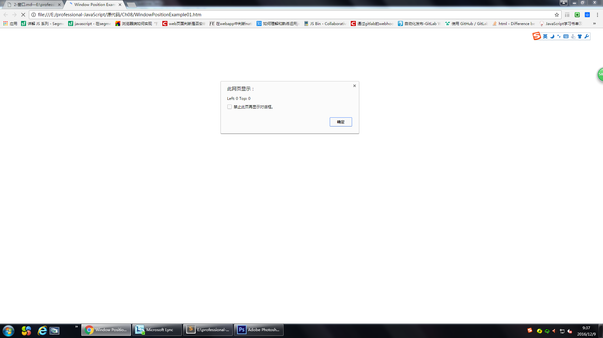
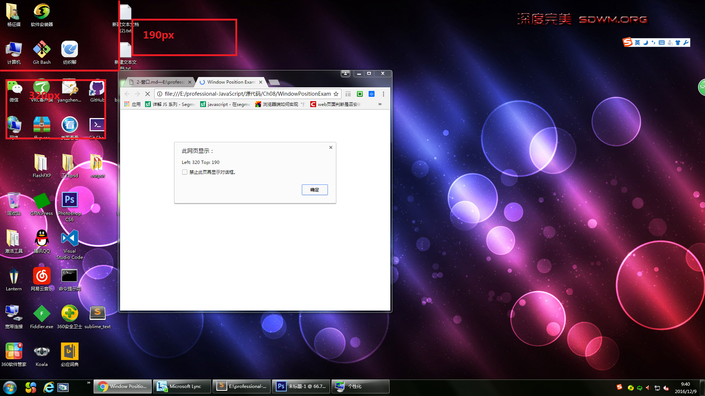

###窗口和框架
如果页面中包含框架,则每个框架都拥有自己的window对象,并且保存在frames集合中.在frames集合中,可以通过数值索引(从0开始,从左到右,从上到下)或者框架名称来访问相应的window对象.每个window对象都有一个name属性

例子[FramesetExample01.htm](窗口框架/FramesetExample01.htm)

**_注意,在html文件写框架的时候,body是不能有了_**

如例子中所示,有很多方法来引用框架,但最好还是使用top的方式来引用框架

`top`对象始终指向最高(最外)层的框架,也就是浏览器窗口.使用它可以确保在一个框架中正确的访问另一个框架.因为对于在一个框架中编写的任何代码来说,其中的window对象指向的都是那个框架的特定实例,而非最高层框架

`parent`对象始终指向当前框架的直接上层框架

例子[frameset1.htm](窗口框架/frameset1.htm)

这是一个框架中嵌套框架的例子,如果代码位于`redFrame`或`blueFrame`中,那么parent对象指向的就是`rightFrame`

**_除非最高层窗口(即浏览器窗口)是通过window.open()打开的,否则其window对象的name属性不会包含任何值_**

在使用框架的情况下,浏览器中会存在多个Global对象.在每个框架中定义的全局变量会自动成为框架中window对象的属性

###窗口位置
用`screenLeft`和`screenTop`或者`screenX`和`screenY`来确定窗口到屏幕左边和上面的值

```javascript
var leftPos = (typeof window.screenLeft == "number") ? window.screenLeft : window.screenX

var topPos = (typeof window.screenTop == "number") ? window.screenTop : window.screenY

alert("Left: " + leftPos + " Top: " + topPos)
```





用`moveTo()`或者`moveBy()`移动窗口,这两个方法都接收两个参数

moveTo()接收的是最新位置的x和y坐标,而moveBy()接收的是在水平和垂直方向上移动的像素数

```javascript
//将窗口移动到屏幕左上角
window.moveTo(0,0)

//将窗口下移100px
window.moveBy(0,100)

//将窗口移动到200,300处
window.moveTo(200,300)

//将窗口移动到距离当前窗口位置左50px处
window.moveBy(-50,0)
```
实践见[three.html](open/three.html)

需要注意的是,这两个方法可能会被浏览器禁用.在Opera和IE7(及更高版本)中默认就是禁用的.另外这两个方法不适用于框架,只能对最外层的window对象(浏览器窗口)使用

###窗口大小
[PC尺寸篇.md](关于自适应的一些基本知识/PC尺寸篇.md)

用`resizeTo()`和`resizeBy()`方法可以调整浏览器窗口的大小.这两个方法都接收两个参数,其中resizeTo接收浏览器窗口的新宽度和新高度,而resizeBy接收新窗口与原窗口的宽度与高度的差值

```javascript
//调整到100*100
window.resizeTo(100,100)

//增大100,50
window.resizeBy(100,50)
```

实践见[three.html](open/three.html)

需要注意的是,这两个方法可能会被浏览器禁用.在Opera和IE7(及更高版本)中默认就是禁用的.另外这两个方法不适用于框架,只能对最外层的window对象(浏览器窗口)使用

###导航和打开窗口
使用`window.open()`方法既可以导航到一个特定的URL,也可以打开一个新的浏览器窗口.这个方法可以接收4个参数: 1.要加载的URL 2.窗口目标 3.一个特性字符串 4.表示新页面是否取代浏览器历史记录中当前加载页面的布尔值  最后一个参数只在不打开新窗口的情况下使用

如果window.open()传递了第二个参数,而且该参数是已有窗口或框架的名称,那么就会在具有该名称的窗口或框架中加载第一个参数指定的URL

[two.html](open/two.html)

第二个参数除了指定的窗口或者框架,也可以是

- target="_self"
- target="_parent"
- target="_top"
- target="_blank"


