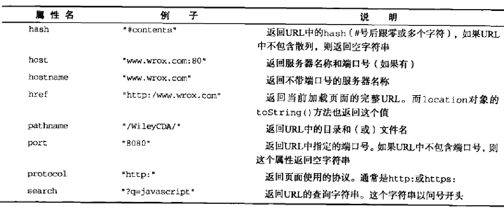

`location`提供了与当前窗口中加载的文档有关的信息.它既是`window`对象的属性,也是`document`对象的属性,换句话说,`window.location`和`document.location`引用的是同一个对象

以下是location对象的所有属性



####查询字符串参数优化
```javascript
function getQueryStringArgs(){

    var qs = ( location.search ? location.search.substring(1) : "" ),
        args = {},
        items = qs.length ? qs.split("&") : [],
        item = null,
        name = null,
        value = null

    for( var i = 0; i < items.length; i++ ){
        item = items[i].split("=")
        name = decodeURIComponent(item[0])
        value = decodeURIComponent(item[1])

        if( name.length ){
            args[name] = value
        }
    }

    return args

}
```

####位置操作
- assign()

使用location对象可以通过很多方式来改变浏览器的位置(就是改变域名).最常用的方式,就是使用`assign()`方法并为其传递一个URL

例如`location.assign("https://segmentfault.com/")`

这样,就能立即打开新URL并在浏览器的历史记录中生成一条记录.以下效果等同

```javascript
window.location = "https://segmentfault.com/"

location.href = "https://segmentfault.com/"
```

- replace()

每次修改location的属性(hash除外),页面都会以新URL重新加载,并且浏览器的历史记录中就会生成一条新记录,因此用户通过单击后退按钮都会导航到前一个页面.要禁止这种行为,可以使用replace()方法.这个方法只接收一个参数,即要导航到的URL.结果虽然会导致浏览器位置改变,但不会在历史记录中生成新记录.在调用replace()方法之后,用户不能回到前一个页面

- reload()

reload的作用是重新加载当前显示页面.如果调用reload()时不传递任何参数,页面就会以最有效的方式重新加载.也就是说,如果页面自上次请求以来并没有改变过,页面就会从浏览器缓存中重新加载.如果要强制从服务器重新加载,则需要传递参数true

`location.reload()`重新加载(可能从缓存中加载)

`location.reload(true)`重新加载(从服务器重新加载)

**_位于reload()调用之后的代码可能会也可能不会执行,这取决于网络延迟或系统资源等因素.所以,最好将reload()放在代码的最后一行_**

 
