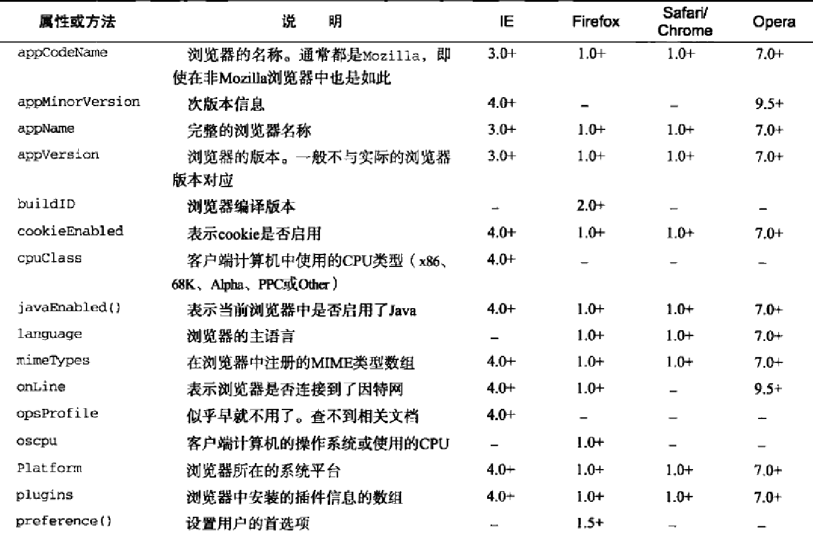
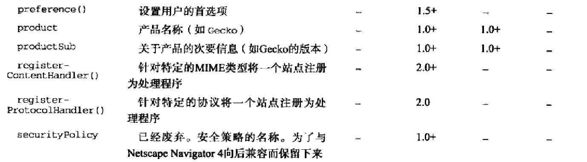
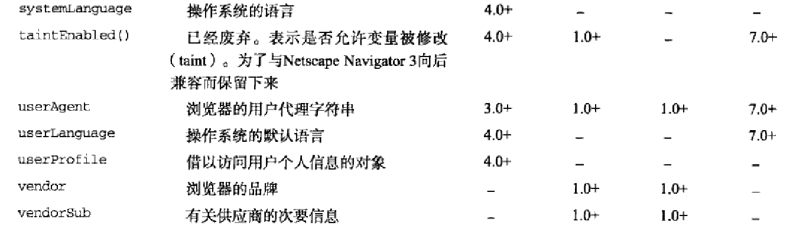

`navigator`对象用来识别客户端浏览器的事实标准.通过自身拥有的属性和方法来检测所需要的信息







####检测插件
可以通过`navigator.plugins`来检测浏览器是否安装了特定插件.navigator.plugins是一个对象数组,每个对象都是一个对插件的描述,拥有以下4个属性:

- name: 插件名
- description: 插件的描述
- filename: 插件的文件名
- length: 插件所处理的MIME类型数量

MIME: 在把输出结果传送到浏览器上的时候,浏览器必须启用适当应用程序来处理输出的文档,而这需要多种类型的MIME来完成

```javascript
//在非IE中检测插件
function hasPlugin(name){
    var name = name.toLowerCase()

    for( var i=0; i<navigator.plugins.length; i++ ){
        if( navigator.plugins[i].name.toLowerCase().indexOf(name) > -1 ){
            return true
        }
    }

    return false
}

//传入参数: 要检测的插件名称
alert( hasPlugin("Flash") )

alert( hasPlugin("QuickTime") )
```


