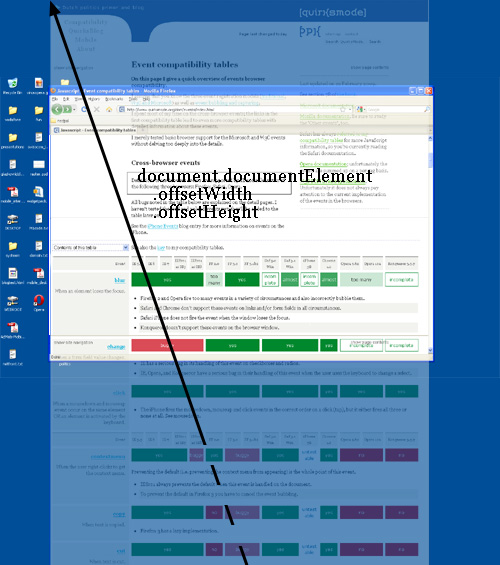
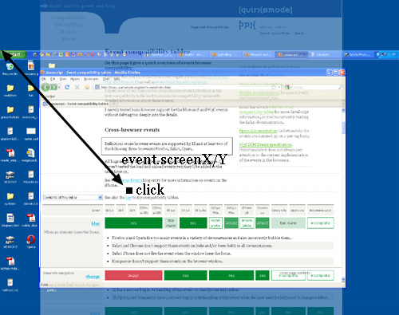

###屏幕尺寸
####window.screen.width/height
- 含义: 用户屏幕总大小
- 度量: 设备像素
- 兼容性: IE7/IE8以CSS像素来度量

`window.screen.width/height`返回的是屏幕的宽高,它们的值并不会因为浏览器的缩放而改变.它们是显示器的特性,而不是浏览器.


按照道理应该这样,但各大浏览器并没有好好的实现这一规则.chrome浏览器(版本号53.0.2785.116),不论浏览器是否缩放,返回的都是不变的屏幕宽高;Firefox(版本号47.0.1)在缩放80%的时候,才正常返回屏幕宽高;IE和Edge都是在缩放100%的时候,才能正常返回屏幕宽高

###浏览器内部尺寸
####window.innerWidth/Height
- 浏览器视口,如果存在滚动条则包括滚动条
- 度量: 单位：像素
- 兼容性: 如下图


返回值为浏览器窗口大小.支持此事件的浏览器受缩放影响


###浏览器外部尺寸
####window.outerWidth/Height
- 整个浏览器的宽高(包括了浏览器的工具条等)
- 度量: 单位：像素
- 兼容性: 如下图


Window.outerWidth/Height获取浏览器窗口外部的宽高.表示整个浏览器窗口的宽高,包括侧边栏(如果存在)/窗口镶边(window chrome)和调正窗口大小的边框


###浏览器可用最大尺寸
###window.availWidth/Height
- 浏览器能占据屏幕的最大宽高
- 度量: 单位：像素

返回浏览器窗口在屏幕上可占用的最大横宽或竖宽空间，即最大宽高度


###滚动移位
####window.pageX/YOffset == window.scrollX/Y
- 页面的移位(滚动条的移位)
- 度量: 单位：像素
- 兼容性: 为了兼容性更好,建议使用window.pageX/YOffset IE8及以下两个属性都不支持
    - 兼容方式
    
        ```
        var x = (window.pageXOffset !== undefined) ? window.pageXOffset : (document.documentElement || document.body.parentNode || document.body).scrollLeft;
        ```

        ```
        var y = (window.pageYOffset !== undefined) ? window.pageYOffset : (document.documentElement || document.body.parentNode || document.body).scrollTop;
        ```

这两对方法定义了页面(document)的相对于窗口原点的水平/垂直位移.因此能够定位用户滚动了多少的滚动条距离.


###viewport
viewport的功能在于控制DOM中的根节点元素`<html>`.

此话何解,举个例子.

当有一个侧边栏`<div class="sidebar">`,设置`width: 10%`,那么当浏览器大小改变的时候,侧边栏始终保持浏览器当前大小的10%.这是什么原因呢?

因为侧边栏的10%的width是根据`<body>`的总宽度的10%来衡量的.

那么`<body>`的总宽度又是哪里得到的呢?

`<body>`的总宽度是根据`<html>`的总宽度得来的.

`<html>`的总宽度又是哪里得到的呢?

`<html>`的总宽度则是从viewport中来的.`<html>`的宽度受限制于viewport.虽然`<html>`可以设置宽度,使其不再受限制于viewport,可是并不推荐这么做.而viewport是严格等于浏览器窗口.所以这就说的通为什么一个侧边栏width的10%会始终等于浏览器窗口的10%了.

####注意
**_viewport不是HTML的概念,所以不能通过CSS来获得/修改其大小,viewport就是浏览器窗口的宽高_**

###document.documentElement.clientWidth/Height
- viewport的尺寸,其实就是window.innerWidth/Height减去滚动条的宽
- 度量: 单位：像素


虽然`document.documentElement`的意思是`<html>`,但`document.documentElement.clientWidth/Height`宽高总是反映浏览器窗口的宽高,并不会因为`<html`>`的宽高的改变而改变.

比如,为`<html>`元素赋值25%。但`document.documentElement.clientWidth/Height`的值不变


我大胆的猜测一下(只是一个猜想,并不一定正确).在定义`<html>`的宽度的时候,开发人员的本意就是默认始终使其宽度等于viewport所代表的宽度,但也为`<html>`赋予了可以自由改变CSS宽度的权利(并不建议这么做),而又因为viewport不是HTML的概念,那么为了有一个可以测得viewport的所代表的宽度,于是设置了`document.documentElement.clientWidth`始终表示viewport的宽度

###document.documentElement.offsetWidth/Height
- 测量的是`<html>`的真实宽高
- 度量: 单位：像素
- 兼容性: IE8及以上反映的是跟`window.innerWidth/Height`一样的东西

在这里,`document.documentElement.offsetWidth/Height`只反映`<html>`的真实宽高,比如`<body>`我设置宽为`2500px`,但是`<html>`设置的宽是`1000px`,那么通过`document.documentElement.offsetWidth`反映出来的宽就是`1000px`,而不会因为`<body>`的宽而影响到`<html>`




###事件坐标
####pageX/Y,clientX/Y,screenX/Y
- pageX/Y：从`<html>`原点到事件触发点的CSS像素
- clientX/Y：从viewport原点到事件触发点的CSS像素
- screenX/Y：从用户显示器窗口原点到事件触发点的设备像素
- 兼容性: IE不支持pageX/Y,IE使用CSS像素来度量screanX/Y




###媒体查询
- 兼容性: 
    - IE不支持
    - 如果`device-width/height`是以CSS像素进行度量的,那么Firefox将会使用`screen.width/height`的值
    - 如果`width/height`是以设备像素进行度量的，那么Safari和Chrome将会使用`documentElement.clientWidth/Height`的值

####例子
```CSS
div.sidebar {
    width: 300px;
}

@media all and (max-width: 400px) {

    // styles assigned when width is smaller than 400px;
    div.sidebar {
        width: 100px;
    }

}
```
在一般情况下,这里的侧边栏宽度是300px,而当宽度小于400像素的时候,那么侧边栏变成100px.那么小于400像素是谁小于400像素,即这里度量的是哪个宽度?

这里有两个对应的媒体查询: `width/height`和`device-width/device-height`

- `width/height`使用和`documentElement .clientWidth/Height`(换句话说就是viewport宽高)一样的值.它是工作在CSS像素下的

- `device-width/device-height`使用和`screen.width/height`(换句话说就是屏幕的宽高)一样的值.它工作在设备像素下面


在pc下,毫无疑问,我们使用`width`,我们只需要关注浏览器窗口大小就好了

那么在移动端呢?


###参考
- [screen.width/height](https://developer.mozilla.org/zh-CN/docs/Web/API/Screen/width)

- [window.innerWidth/Height](https://developer.mozilla.org/zh-CN/docs/Web/API/Window/innerWidth)

- [window.outerWidth/Height](https://developer.mozilla.org/zh-CN/docs/Web/API/Window/outerWidth)

- [window.availWidth/Height](https://developer.mozilla.org/zh-CN/docs/Web/API/Screen/availHeight)

- [window.scrollX/Y](https://developer.mozilla.org/zh-CN/docs/Web/API/Window/scrollX)

- [http://www.w3cplus.com/css/viewports.html](http://www.w3cplus.com/css/viewports.html)

- [http://www.quirksmode.org/mobile/viewports.html](http://www.quirksmode.org/mobile/viewports.html)


