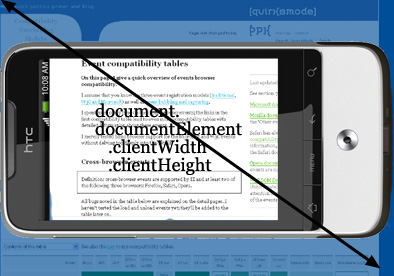

###移动端浏览器的问题
与pc端浏览器相比,移动浏览器的尺寸远远小于前者,那么CSS的布局就出现了很大的问题.比如一个屏幕为400px宽的移动设备,当我把一个侧边栏`
`设置为`width: 10%`,那么是不是意味着这个侧边栏只有40px呢?这是不是就太小了?而如果把pc端网站的CSS都照搬到移动端,那么可想而知,布局会多么的混乱.

###两个viewport
移动端浏览器的问题关键在于viewport,viewport太窄,导致了CSS的混乱.所以在移动端,viewport又分化成了`visual viewport`和`layout viewport`

George Cummins在[Stack Overflow](http://stackoverflow.com/questions/6333927/difference-between-visual-viewport-and-layout-viewport)上对基本概念给出了最佳解释

>想象下layoutviewport是一张大的不能改变大小和角度的图片.现在你有个更小的框来观看这张大图片,这个框被不透明的材料包围,因而你只能看到大图片的一部分.你通过这个框子看到的大图片的部分被称为虚拟viewport(visual viewport).你能拿着这个框站得离大图片远点（用户的缩小页面功能）,以一次性看到这个大图片.或者你能站得近点（用户的放大页面功能）以看到一部分.你能改变这个框子的方向,但这张大图片的大小和形状都不会改变

无论怎样,CSS布局,尤其是百分比宽度,是以layout viewport做为参照系来计算的,它被认为要比visual viewport宽

所以`<html>`元素在**_初始情况下用的是layout viewport的宽度_**,并且你的CSS是在屏幕(宽度等于layout viewport的虚拟屏幕)好像明显比手机屏幕(物理屏幕)要宽的假设基础上进行解释的.这使得站点布局的行为与其在桌面浏览器上的一样

由上面对`visual viewport`和`layout viewport`的描述,所以我更愿意把`visual viewport`翻译成`可视化视口`,把`layout viewport`翻译成`布局视图`,因为用户只是在`框中阅读`,而开发者却是在`布局作业`.

`layout viewport`有多宽

- Safari iPhone为980px
- Opera为850px
- Android WebKit为800px
- IE为974px

一些浏览器的特殊情况

- `Symbian WebKit`会保持`layout viewport`与`visual viewport`相等,是的,这意味着拥有百分比宽度元素的行为可能会比较奇怪.但是,如果页面由于设置了绝对宽度而不能放入`visual viewport`中,那么浏览器会把`layout viewport`拉伸到最大850px宽
- `Samsung WebKit(on bada)`使`layout viewport`和最宽的元素一样宽
- 在`BlackBerry`上,`layout viewport`在100%缩放比例的情况下等于`visual viewport`

你可能会想,如果设计师给的视觉稿是1000+px,那么在Safari的980px的`layout viewport`又有什么用呢?

`layout viewport`是为了让设计师给出的视觉稿排版先使其正确,然后进行缩放,在`visual viewport`中使其表现在移动屏幕上正确.

**_所以`layout viewport`不代表真实页面的宽高_**

###缩放
很显然两个viewport都是以CSS像素度量的.但是当进行缩放(如果你放大,屏幕上的CSS像素会变少)的时候,`visual viewport的尺寸会发生变化`,`layout viewport的尺寸仍然跟之前的一样`(如果不这样,你的页面将会像百分比宽度被重新计算一样而经常被重新布局)

###layout viewport
####document.documentElement.clientWidth/Height
- 意义: layout viewport的尺寸
- 度量单位: CSS像素
- 完全支持Opera,iPhone,Android,Symbian,Bolt,MicroB,Skyfire,Obigo
- 在Iris中Visual viewport有问题
    - Samsung WebKit在页面应用了`<meta viewport>`标签的时候会返回正确的值,否则使用`<html>`元素的尺寸
    - Firefox返回以设备像素为单位的屏幕尺寸
    - IE返回1024x768.然而,它把信息存储在`document.body.clientWidth/Height`中
    - NetFront的值只在100%缩放比例的情况下是正确的
    - Symbian WebKit 1(老的S60v3设备)不支持这些属性
- BlackBerry不支持

移动工具的翻转会对layout viewport的高度产生影响,但开发人员只需要关心宽度就好

###visual viewport
####window.innerWidth/Height
- 意义：Visual viewport的尺寸
- 度量单位：CSS像素
- 完全支持iPhone,Symbian,BlackBerry
- 问题
    + Opera和Firefox返回以设备像素为单位的屏幕宽度
    + Android,Bolt,MicroB和NetFront返回以CSS像素为单位的layout viewport尺寸
- 不支持IE,但是它在`document.documentElement.offsetWidth/Height`中提供`visual viewport`的尺寸
    + Samsung WebKit返回的是`layout viewport`或者`<html>`的尺寸,这取决于页面是否应用了`<meta viewport>`标签
- Iris,Skyfire,Obigo根本就是扯淡

###屏幕
####screen.width/height
像桌面环境一样,`screen.width/height`提供了以设备像素为单位的屏幕尺寸.像在桌面环境上一样,做为一个开发者你永远不需要这个信息.你对屏幕的物理尺寸不感兴趣,而是对屏幕上当前有多少CSS像素感兴趣

- 意义: 屏幕尺寸
- 度量单位: 设备像素
- 完全支持Opera Mini,Android,Symbian,Iris,Firefox,MicroB,IE,BlackBerry
- 问题：Windows Mobile上的Opera Mobile只提供了风景模式（横屏）的尺寸.S60上的Opera Mobile返回的值是正确的
    + Samsung WebKit返回layout viewport或者<html>的尺寸,这取决于是否在页面上应用了<meta viewport>标签
    + iPhone和Obigo只提供了肖像模式（竖屏）的尺寸
    + NetFront只提供风景模式（横屏）的尺寸
- Bolt,Skyfire依旧在扯淡

###滚动距离
####window.pageX/YOffset
- 意义：滚动距离.与visual viewport相对于layout viewport的距离一样
- 度量单位：CSS像素
- 完全支持iPhone,Android,Symbian,Iris,MicroB,Skyfire,Obigo
- 问题：Opera,Bolt,Firefox和NetFront一直返回0
    + Samsung WebKit只有当<meta viewport>被应用到页面上时候才返回正确的值
- 不支持IE,BlackBerry.IE把值存在document.documentElement.scrollLeft/Top之中

###root element
####document.documentElement.offsetWidth/Height
- 意义：<html>元素的整体尺寸
- 度量单位：CSS像素
- 完全支持Opera,iPhone,Android,Symbian,Samsung,Iris,Bolt,Firefox,MicroB,Skyfire,BlackBerry,Obigo
- 问题：NetFront的值只在100%缩放比例的情况下才正确
    + IE使用这个属性对来存储visual viewport的尺寸.在IE中,去document.body.clientWidth/Height中获取正确的值

###媒体查询
媒体查询和其在桌面环境上的工作方式一样.`width/height`使用`layout　viewport`做为参照物,并且以CSS像素进行度量,`device-width/height`使用`设备屏幕`,并且以设备像素进行度量

换句话说,width/height是document.documentElement.clientWidth/Height值的镜像,同时device-width/height是screen.width/height值的镜像.(它们在所有浏览器中实际上就是这么做的,即使这个镜像的值不正确)

- 意义：度量<html>元素的宽度(CSS像素)或者设备宽度(设备像素)
- 完全支持Opera,iPhone,Android,Symbian,Samsung,Iris,Bolt,Firefox,MicroB
- 不支持Skyfire,IE,BlackBerry,NetFront,Obigo
- 注意我在这里测试的是浏览器是否能从正确的「属性对」获取它们的数据.这些属性对是否提供正确的信息不是这个测试的一部分

###事件坐标
####pageX/Y,clientX/Y,screenX/Y
- 完全支持Symbian,Iris
- 问题：Opera Mobile在三个属性对中提供的都是pageX/Y的值,但是当你滚动一段距离后就出问题了
    + 在iPhone,Firefox和BlackBerry上clientX/Y等于pageX/Y
    + 在Android和MicroB上screenX/Y等于clientX/Y（换句话说,也就是以CSS像素为单位）
    + 在Firefox上screenX/Y是错的
    + IE,BlackBerry和Obigo不支持pageX/Y
    + 在NetFront上三个属性对的值都等于screenX/Y
    + 在Obigo上clientX/Y等于screenX/Y
    + Samsung WebKit一直返回pageX/Y
- 没有在Opera Mini,Bolt,Skyfire上测试过

###Meta viewport
- 意义：设置layout viewport的宽度
- 度量单位：CSS像素
- 完全支持Opera Mobile,iPhone,Android,Iris,IE,BlackBerry,Obigo
- 不支持Opera Mini,Symbian,Bolt,Firefox,MicroB,NetFront
- 问题：Skyfire不能处理我的测试页面
    + 如果在Samsung WebKit中对页面应用`<meta viewport>`,一些其他属性的意义会发生变化
    + Opera Mobile,iPhone,Samsung和BlackBerry不允许用户进行缩小

###适配方案
根据上面的概念讲解,我们可以有两种方式来让JS调节rem适配不同尺寸的移动端屏幕
方案一:

- `<meta name="viewport" content="width=device-width">` 让`设备尺寸` = `visual viewport` = `layout viewport` 详见`js适配根字体方法1.md`/`js适配根字体方法2.md`
- scale缩放(手淘js适配方式)详见`js适配根字体方法3.md`或者`build`.优点如下
    + border: 1px问题
    + 图片高清问题
    + 屏幕适配布局问题

###参考
- [http://www.imooc.com/learn/494](参考http://www.imooc.com/learn/494)
- [http://div.io/topic/1092?page=1](http://div.io/topic/1092?page=1)
- [http://www.w3cplus.com/css/viewports.html](http://www.w3cplus.com/css/viewports.html)
- [http://www.quirksmode.org/mobile/viewports2.html](http://www.quirksmode.org/mobile/viewports2.html)

